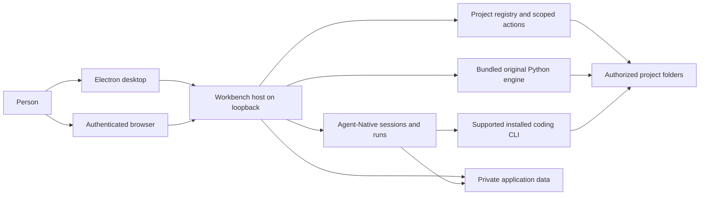
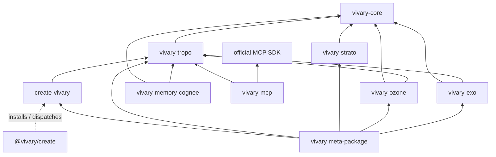

# Vivary architecture

This is the high-level design for the desktop and self-hosted product in `vivary-dev/Vivary-New`. It describes the system that contributors change and the boundaries they must preserve. The [module catalog](product/multi-project/specification/modules.md) owns detailed responsibilities and source entry points. The [desktop acceptance register](product/multi-project/desktop-acceptance-status.md) owns proof by candidate. GitHub issues own task scope and lifecycle.

## Purpose and owner intent

Jeff's [desktop release decision](product/multi-project/desktop-release.md) calls for one Vivary instance on a user-controlled computer or suitable server. A local desktop window and a responsive browser connect to that host. The host keeps agents, project files, credentials, history, and memory. Local desktop use needs no Vivary account. Remote browser access requires explicit setup and authentication. Zo hosts development and a private preview. It is not a required user service.

The [unified workspace decision](product/multi-project/design.md#unified-workspace-decision-2026-09-14) puts one selected project conversation at the center. A project can have several independent conversations. Files, details, search, and preview open as optional panels. Supported installed coding runtimes retain their own tools, models, permissions, and sessions. Vivary binds their work to the selected project. A cross-runtime link and a maintained handoff remain separate product capabilities, not an implicit transfer of a live run. The [interaction contract](product/multi-project/unified-workspace.md) owns those details.

The original Vivary engine remains available as standalone commands and through bounded application operations. A project keeps its own folder and conventions. The original five-file workspace contract, plain authored files, and optional version control let a user continue work without the GUI. The [original CLI reference](ORIGINAL-CLI.md) owns command and release status.

The original design reduces active agent context. `AGENTS.md` routes to `.vivary/context.md`, and `STATE.md` is read when state matters. Typed records arise from actual work. Core keeps evidence, provenance, receipts, and authority explicit. Optional semantic retrieval can suggest candidates, but it does not become authored truth. [Original CLI architecture](#original-engine) explains the package boundaries.

## Success criteria

The [desktop release journey](product/multi-project/desktop-release.md#acceptance-journey) defines observable success. A person can install and open the Windows package without a source checkout or Vivary account, create and adopt projects, and run authorized work in each. They can inspect actual tool results, stop work, close the app, and reopen the same project and conversation. They can save a project fact, retrieve it in a fresh session, correct it, and remove it from active memory. They can find an older chat by message content and search project files by filename, exact text, and regex. They can use all ten original command verbs through the installed operations. A desktop and phone browser can connect to the same authenticated private host, and a project preview can support an observed error and authorized repair.

These are release criteria, not a claim that the full journey passes. The [acceptance register](product/multi-project/desktop-acceptance-status.md#capability-and-acceptance-gaps) names the tested source and platform for each accepted slice and the remaining gaps. Hosted, simulated-provider, and packaged Windows evidence have different limits.

## System structure

The Electron process starts a local Workbench server, opens its loopback origin, and manages shutdown. The browser client presents the same host state. The Workbench launcher chooses local, hosted, or private-proxy access and locates private data. The source owners are [`packages/desktop/main.mjs`](../packages/desktop/main.mjs), [`packages/workbench/bin/start.mjs`](../packages/workbench/bin/start.mjs), and [`server/local-access.ts`](../packages/workbench/server/local-access.ts). The browser does not run agents or mount a phone's files.

Workbench composes Agent-Native's application, chat, run, action, and storage owners. Native keeps transcripts and run lifecycle. Workbench keeps project identity and authorized root bindings, then resolves those bindings for actions and sends. The registry uses Native's database with Workbench project, binding, revision, receipt, and mutation tables. See the [project registry](product/multi-project/source-map/modules/project-registry/index.md), [`project-services.mjs`](../packages/workbench/server/project-services.mjs), and [`db/schema.mjs`](../packages/workbench/server/db/schema.mjs). An observed path is not by itself a project identity or a write grant.

The selected coding runtime owns execution, tools, model access, and native session continuity. Workbench currently supports Claude Code and Codex through Native Code records and the local Code host. Codex uses its app-server and account-effective model catalog. Workbench relays native approvals, progress, child activity, and Stop. Native provider chat uses Native's chat owner with a project send guard. The [harness adapter contract](product/multi-project/specification/harness-adapters.md), [Native owner map](product/multi-project/native-owners.md), and [runtime source map](product/multi-project/source-map/modules/native-runtime/index.md) describe the distinct owners.

### Original engine

The original engine remains a package family, not another agent loop. `vivary-core` owns pure validation and projection while callers retain execution, persistence, and human approval. Tropo observes, builds typed graph context, and retrieves. Strato evaluates policy. Ozone verifies evidence and proposes gated repairs. Exo projects claims, dependencies, and handoffs. `create-vivary` creates and adopts workspaces. The optional MCP and semantic-memory adapters are outside the default package path. The `vivary` front door routes ten verbs to their package owners. The Workbench bundles this Python runtime and calls its established commands rather than reimplementing their decisions. See [the command reference](COMMANDS.md) and [package manifests](../packages).

### The shared seam: vivary-core

Core is a library shared by Tropo, Strato, Ozone, and Exo. It owns deterministic
evidence projection, bounded task capsules, receipt validation, policy decisions,
and control-state projection. Callers retain clocks, execution, state persistence,
and human approval. Unknown, conflicting, or omitted evidence stays visible.
Observed ambiguity does not become permission to act. The [Core contract](../packages/core/README.md)
owns the detailed schemas and refusal rules.

### Package dependency map

This map shows direct source-manifest dependencies; omitted arrows are deliberately
absent. In particular, the `vivary` meta-package receives Core transitively, while MCP
and memory remain optional and outside that meta-package.

The [package manifests](../packages) own dependency version floors. Each
shipping package declares the Core dependency it imports. The meta-package
receives Core through its component dependencies. Source versions and published
versions remain distinct in the [CLI release status](ORIGINAL-CLI.md#release-status).

### Distribution names

The package names remain part of the original engine's architecture. The
[original CLI release status](ORIGINAL-CLI.md#release-status) owns published
versions. A changed source version is not evidence of a registry release.

- npm: `@vivary/create` launches the workspace creator.
- PyPI: `vivary`, `vivary-core`, `vivary-tropo`, `vivary-strato`, `vivary-ozone`,
  `vivary-exo`, `create-vivary`, `vivary-memory-cognee`, and `vivary-mcp`.

The optional memory and MCP distributions remain outside the default path.
Coordinated releases publish Core before its dependent role packages.

## Runtime flows

1. **Select a project.** Workbench resolves the authenticated actor, stable project ID, current binding, policy revision, and observed root. Project selection changes the files and history shown. A missing folder leaves authorized history available but blocks file-dependent execution. [Project registry](product/multi-project/source-map/modules/project-registry/index.md) owns the identity contract.
2. **Send and continue.** A Native chat send rechecks its pinned project scope before model or attachment work. A Code send starts or resumes the selected native session against its bound project. Native stores the resulting run and transcript. A model choice or project switch cannot silently move an active run. [`native-chat-project.ts`](../packages/workbench/server/native-chat-project.ts), [`local-code-agent.ts`](../packages/workbench/server/local-code-agent.ts), and the [session model](product/multi-project/desktop-release.md#one-understandable-model) own this flow.
   Each project message also loads the project's context when it starts. [`project-memory.ts`](../packages/workbench/server/project-memory.ts) reads the law files, the state file, and the fact files in the memory folders from the admitted project only, and renders one block of at most 8,000 characters. A Code send puts the block before the engine prompt. A new run and every Claude follow-up get the full block, because each Claude turn is a fresh CLI session. A resumed Codex thread gets the full block when the revision differs from the last turn the engine completed, and otherwise one line saying the revision is unchanged. A turn that fails, stops, or is interrupted rolls its revision back. Only Full chat blocks name Native's owner-wide tools. The thread still holds the earlier block, so this saves repeating up to 8,000 characters per turn. The tradeoff: if Codex compacts the thread and drops that block, the agent sees only the unchanged line until the context changes or a new conversation starts. The transcript keeps only the typed message, and one note per turn, which the Code view shows, names the loaded revision and whether it changed. The panel's last load is recorded only after the send passes its refusals and claims the host slot. Full chat returns the block from Native's `extraContext` on every send. A change to a fact file therefore applies from the next message, in new and open conversations, and after a restart. A reply already running keeps what it started with.
3. **Approve, deny, or stop.** Native owns an action request and its execution lifecycle. Workbench checks the owner, project, run, and exact request before relaying a decision. Stop targets the owned running work. Client closure does not itself approve or replay an action. The [coding permission decision](product/multi-project/design.md#native-coding-permissions-and-activity-2026-09-16) and [authority module](product/multi-project/specification/modules.md#m05-authority-and-approvals) own the rules.
4. **Read and change project files.** Scoped file actions list and read bounded content. Explicit Save and Rename check the selected project and file revision. Project memory is the only caller of the file service's exclusive Create and version-checked Remove, which reuse the same link refusal, per-project mutation queue, and conflicts. The Memory section in Project details calls two owner actions, `vivary-project-memory` and `vivary-project-memory-write`. It shows the memory folder and why it applies, the role assignments, when changes apply, each fact with its source and file, the exact block the next message receives, and the last load in this app session. Remember, correct, and forget write the owning file, and forget states what it cannot erase. Neither action is an agent tool. The Search panel walks one authorized project with caps, private-file exclusions, and continuation. It does not use a persistent index or a shell search process. [`project-files.ts`](../packages/workbench/server/project-files.ts), [`project-search.ts`](../packages/workbench/server/project-search.ts), and the [write-back map](product/multi-project/source-map/modules/project-writeback/index.md) own the behavior and limits.
5. **Call the original engine.** The bundled Python runtime receives a bounded command and a selected project root. The five project read reports share one server module for the Details panel and the Native tool. The agent tool gets its project from the chat's pinned scope, not model-supplied input. Public Doctor, Find, and Check use the privacy-filtered CLI path. Governed writes retain their own plan, authority, and receipt rules. [`original-runtime.ts`](../packages/workbench/server/original-runtime.ts), [`project-read.ts`](../packages/workbench/server/project-read.ts), and the [issue #19 receipt](product/multi-project/receipts/09b-original-read-tools.md) record the delivered slice.
6. **Preview a project.** A reviewed local command starts a project process. The app presents its page in an isolated frame and supports Stop. The selected coding runtime can inspect and repair the project through its supported browser tools. The [preview receipt](product/multi-project/receipts/11e-live-project-preview.md) states what passed on Zo and what still needs packaged or platform proof.

## Data and trust boundaries

| Data or effect | Owner and boundary |
| --- | --- |
| Project files and authored memory | Stay in the user's authorized folder. Workspace roles identify authored knowledge. Authored facts are one Markdown file per fact in `.vivary/knowledge/` or the folders the `memory` role names. In a thin workspace Tropo types them as `vivary_fact`, which requires a source and a confirmed date, at both its private and public compose paths. `.vivary/memory/` is disposable semantic-provider state, not an authored note store, and provider forget never touches authored facts. Memory folders, law files, and the state file never use `.git`, `.vivary/memory`, the engine's declared private, runtime, and capability storage paths, or boundary role paths, compared without regard to case. A memory folder, law file, state file, or fact file that the workspace's `.gitignore` files ignore is not loaded, and no new fact is saved in an ignored folder. The engine checks `.gitignore` files only. It does not read `.git/info/exclude` or global Git excludes, so a rule kept only there does not make memory private. Agents receive facts as labeled information in the per-message project block, never as instructions. Project chats do not get Native's owner-wide `resources`, `save-memory`, `delete-memory`, or `chat-history` actions, because those stores have no project column. Native drops the framework prompt lines that name them, but its resources context note stays in the prompt, so every project block says the tools are unavailable. Personal and legacy chats keep them. |
| Project identities and bindings | Workbench registry tables in private Native-backed application data. The server checks actor, collection, device, policy, and observed root before effects. |
| Conversations, runs, and approvals | Native records in private application data. Workbench stores references and project scope rather than copying full transcripts into a second store. |
| CLI credentials and logs | Stay in each provider's supported location. Vivary references native sessions. App-invoked original command receipts go to private application data. |
| Search results and indexes | Project file search reads the authorized folder with bounded work. A future derived index is rebuildable and belongs in private application data. |
| Preview processes | Start only from reviewed project commands. Preview content is isolated from privileged Workbench state. Stop and host shutdown own cleanup. |

The local desktop server binds to loopback and opens without a Vivary login. Hosted mode uses Native authentication. The private Zo preview uses its owner-login proxy boundary. Remote access to a user's host remains an explicit, authenticated setup requirement, with real-phone and revocation acceptance still open. [`local-access.ts`](../packages/workbench/server/local-access.ts) owns request checks. The [host decision](product/multi-project/design.md#host-and-browser-access-decision-2026-09-13) owns the product boundary.

The Electron window accepts its local server origin, isolates the renderer, denies browser permissions and downloads, and routes a small set of setup links externally. A project grant does not bypass CLI-native permissions. A prompt containing a path is not filesystem isolation. The selected harness may send supplied model context to its provider. Local storage does not imply offline model inference. The [runtime isolation decision](product/multi-project/design.md#runtime-ownership-and-isolation) and [desktop host](../packages/desktop/main.mjs) own those limits.

## Delivery and known gaps

The unified workspace, project registration and selection, scoped Code and Native history, bounded files and search, reviewed project preview, bundled original CLI, and selected original operations have implemented and tested slices. The [acceptance register](product/multi-project/desktop-acceptance-status.md) states their candidate-specific evidence. A passing component or source check does not complete the desktop and browser release journey.

Issue #19's five project read reports entered `dev` in PR #89. Its receipt records hosted fake-provider proof and earlier Windows packages. The final `e6ccddf5` Windows package's panel reads and agent turn were still pending in that receipt. Treat that acceptance as pending until the owning issue and register record the later result. PR #90 added [route-question research](product/multi-project/research/tropo-find-route-questions.md) only. It did not change Tropo's public path refusal or MCP privacy rules.

Issue #21's scoped file memory is implemented. Code and Full chat load each project's instructions, state, and facts per message. Its [receipt](product/multi-project/receipts/18a-scoped-file-memory.md) records an 11-step hosted journey that passed three runs in a row on `17e2996e` with a fake provider, and one real Codex check on the same commit. Packaged Windows acceptance has not run, and no real Claude or Native-provider turn has, so it is not accepted. Chat-content search, a generic grouped harness catalog, linked cross-harness conversations, concurrent root runs, and complete GUI/agent coverage of all original operations remain open. Real Native-provider turns belong to issue #50. Deterministic-provider checks do not prove them. Automation execution depends on that separate work. Authenticated phone routing, revocation and reconnect, packaged preview behavior, upgrade and removal, and final Windows acceptance remain release work. The [release target](product/multi-project/desktop-release.md), [module catalog](product/multi-project/specification/modules.md), and live issues own the precise current status.

## Maintaining this document

This page owns the full-product structure, data owners, trust boundaries, and cross-component flows. Detailed contracts and source paths live in the [module catalog](product/multi-project/specification/modules.md) and [source map](product/multi-project/source-map/index.md). Product decisions live in [design.md](product/multi-project/design.md). GitHub issues own goals, acceptance, dependencies, and lifecycle. Update those owners with this page when their facts change.

For a relevant source, configuration, or documentation change, update this page in the same commit. When the change alters architecture, revise the affected description, diagram, flow, boundary, or gap. When an internal change leaves the described architecture true, update **Last change review** with the concrete changed area, why the description still holds, and the evidence checked. A timestamp or whitespace change is not a review. The [maintenance skill](../.agents/skills/maintain-hldd/SKILL.md) gives the review steps. The staged checker, `python scripts/check_hldd.py --staged`, and the branch checker, `python scripts/check_hldd.py --base <ref> --head HEAD`, enforce a substantive document update. They do not judge architectural truth. Human and agent review do that. No commit hook rewrites this page automatically.

The application bundles this document at build time and exposes it through
Settings > Documentation. The reader uses the existing read-only Markdown
component. Its text remains available offline. Source and detailed-reference
links open online through the browser or desktop's existing confirmation flow.
No documentation route reads arbitrary host files.

## Last change review

Issue #21 adds scoped file memory. The runtime flows, the data-boundary row,
and the known gaps above describe it. The review, by layer:

- Engine: Tropo adds the built-in `vivary_fact` type for `.vivary/knowledge`
  and the memory role paths after every owner table and overlay merged, in
  both `_compose` and the public config path, so Doctor and Note check agree.
  An owner type that names a fact folder by path or basename wins, and a
  role path without `/` types only the root-level folder. `workspace_context`
  reports roles, the state file, the effective memory folders, and the
  declared protected paths from configuration. The creator adds which memory
  folders, law files, state file, and fact files the `.gitignore` files
  ignore, and every `.gitignore` it consulted. The bridge serves this as the
  read-only `context` operation, and no absolute host path leaves it. No
  public CLI verb or Doctor output changed.
- Workbench service: `project-memory.ts` memoizes that answer by the digest of
  `.vivary/workspace.toml` and rechecks a fingerprint of every consulted
  `.gitignore` (a missing one counts) and the file names in each memory
  folder, so a new rule or a new fact asks the engine again once. It refuses
  reserved, protected, boundary, ignored, linked, and blocked paths, skips
  ignored fact files, and renders one block of at most 8,000 characters. Each
  fact field is clamped to the panel's save limits (title 120, text 500,
  source 200), so a fact saved in the panel is never cut. Every path in the
  block is neutralized and bounded. Writes admit folders without reading any
  fact, law, or state file. `project-files.ts` gains a folder listing, a
  listed-file read, a content digest, exclusive Create, and version-checked
  Remove on its mutation queue. A Create that conflicts can leave the empty
  folders it made.
- Runs: Code sends put the block, or the unchanged line for a resumed Codex
  thread, before the engine prompt, record `projectContextRevision`, and append
  a `note` event that Native's transcript builder renders. `renderForRun` and
  `recordLoad` are separate, so a refused send leaves the last load alone.
  Full chat wires `extraContext` and `resolveActionSurface`, classified by the
  send guard's pinned-scope check, and denies `chat-history` beside the
  memory and resources actions.
  A request-scoped surface makes Native downgrade trusted production code
  execution to sandboxed. Workbench runs Full chat with code execution off,
  so nothing changes today, and a test pins that.
- Panel: the Memory section in Project details uses two owner actions that
  are not agent tools, so the Full chat model still sees one Vivary tool. It
  keeps the owner's draft on every write conflict, starts Forget with focus on
  Cancel, marks a hand-edited fact that agents receive shortened, and shows
  the preview's revision beside the last load.
- Documents: the Tropo specification, the original CLI reference, the
  module catalog, the Native owner map, the write-back source map, and the
  18a packet log describe the same slice.

Evidence: Tropo, creator, bridge, Cognee forget, project-files,
project-memory, local-code-agent (`started.json` prompts and Native's
transcript builder), project-read, and typecheck. The native chat unit tests
cover the `extraContext` and action-surface closures with stubbed scope and
project reads. The hosted journey with the recording fake provider covers the
real Full chat request, including a restart, and one real Codex conversation
recalled and then corrected a fact. The
[receipt](product/multi-project/receipts/18a-scoped-file-memory.md) holds that
evidence and its observations. Packaged Windows acceptance is pending.

After that QA, a resumed Codex turn sends the full block again when the run's
previous turn failed, stopped, or was interrupted, because that turn's
revision is rolled back. Only the Full chat block names Native's owner-wide
tools. The revision is the hash of the Code form, so both surfaces share it.
A plain folder's panel no longer links to a missing `workspace.toml`, and the
bridge's host-path scrub keeps URLs. The hosted journey passed three more
runs and the real Codex check passed again on `17e2996e`, which includes these
changes. The fake provider now drops the Full chat tools sentence before it
hashes the block, because the revision covers the Code form.

The review follow-up strengthens maintenance enforcement and documentation
navigation. Date-only bullets and emphasis do not count as substantive reviews.
Required sections must be visible prose headings, outside comments and fenced
examples. Git-index and history tests cover both cases. The document reader
resolves reference destinations in rendered links so ordinary activation,
middle-click, and browser context menus use the same target. Its sidebar footer
keeps Documentation, Settings, and search within the supported panel width.
The maintained CI test list now includes documentation-link behavior.

These corrections preserve the product intent, component ownership, and
acceptance boundaries above. The original package inventory and dependency map
remain part of this canonical design. Tests, the built reader, and source-link
checks establish the maintenance and navigation changes. Final Windows read-tool
acceptance remains with issue #19.

The multi-project evidence brief now links to stable architecture sections and
the owning Core, Exo, front-door, capability-status, and MCP contracts. Those
references replace line ranges invalidated by this consolidation. The linked
contracts and dispatch source confirm the same package boundaries. This reference
repair changes no runtime behavior or acceptance claim.
