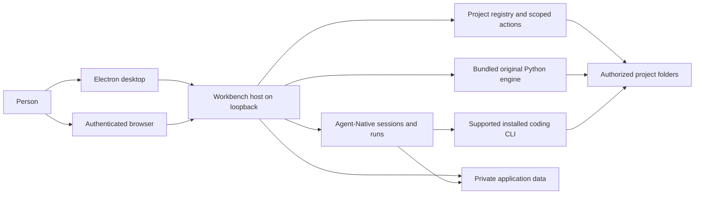
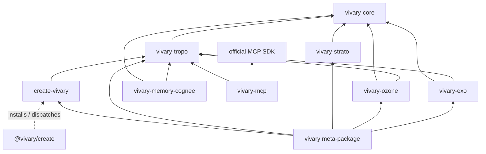

# Vivary architecture

This is the high-level design for the desktop and self-hosted product in `vivary-dev/Vivary-New`. It describes the system that contributors change and the boundaries they must preserve. The [module catalog](product/multi-project/specification/modules.md) owns detailed responsibilities and source entry points. The [desktop acceptance register](product/multi-project/desktop-acceptance-status.md) owns proof by candidate. GitHub issues own task scope and lifecycle.

## Purpose and owner intent

Jeff's [desktop release decision](product/multi-project/desktop-release.md) calls for one Vivary instance on a user-controlled computer or suitable server. A local desktop window and a responsive browser connect to that host. The host keeps agents, project files, credentials, history, and memory. Local desktop use needs no Vivary account. Remote browser access requires explicit setup and authentication. Zo hosts development and a private preview. It is not a required user service.

The [unified workspace decision](product/multi-project/design.md#unified-workspace-decision-2026-09-14) puts one selected project conversation at the center. A project can have several independent conversations. Files, details, search, and preview open as optional panels. Supported installed coding runtimes retain their own tools, models, permissions, and sessions. Vivary binds their work to the selected project. A cross-runtime link and a maintained handoff remain separate product capabilities, not an implicit transfer of a live run. The [interaction contract](product/multi-project/unified-workspace.md) owns those details.

The original Vivary engine remains available as standalone commands and through bounded application operations. A project keeps its own folder and conventions. The original five-file workspace contract, plain authored files, and optional version control let a user continue work without the GUI. The [original CLI reference](ORIGINAL-CLI.md) owns command and release status.

The original design reduces active agent context. `AGENTS.md` routes to `.vivary/context.md`, and `STATE.md` is read when state matters. Typed records arise from actual work. Core keeps evidence, provenance, receipts, and authority explicit. Optional semantic retrieval can suggest candidates, but it does not become authored truth. [Original CLI architecture](#original-engine) explains the package boundaries.

## Success criteria

The [desktop release journey](product/multi-project/desktop-release.md#acceptance-journey) defines observable success. A person can install and open the Windows package without a source checkout or Vivary account, create and adopt projects, and run authorized work in each. They can inspect actual tool results, stop work, close the app, and reopen the same project and conversation. They can save a project fact, retrieve it in a fresh session, correct it, and remove it from active memory. They can find an older chat by message content and search project files by filename, exact text, and regex. They can use all ten original command verbs through the installed operations. A desktop and phone browser can connect to the same authenticated private host, and a project preview can support an observed error and authorized repair.

These are release criteria, not a claim that the full journey passes. The [acceptance register](product/multi-project/desktop-acceptance-status.md#capability-and-acceptance-gaps) names the tested source and platform for each accepted slice and the remaining gaps. Hosted, simulated-provider, and packaged Windows evidence have different limits.

## System structure

The Electron process starts a local Workbench server, opens its loopback origin, and manages shutdown. The browser client presents the same host state. The Workbench launcher chooses local, hosted, or private-proxy access and locates private data. The source owners are [`packages/desktop/main.mjs`](../packages/desktop/main.mjs), [`packages/workbench/bin/start.mjs`](../packages/workbench/bin/start.mjs), and [`server/local-access.ts`](../packages/workbench/server/local-access.ts). The browser does not run agents or mount a phone's files.

Workbench composes Agent-Native's application, chat, run, action, and storage owners. Native keeps transcripts and run lifecycle. Workbench keeps project identity and authorized root bindings, then resolves those bindings for actions and sends. The registry uses Native's database with Workbench project, binding, revision, receipt, and mutation tables. See the [project registry](product/multi-project/source-map/modules/project-registry/index.md), [`project-services.mjs`](../packages/workbench/server/project-services.mjs), and [`db/schema.mjs`](../packages/workbench/server/db/schema.mjs). An observed path is not by itself a project identity or a write grant.

The selected coding runtime owns execution, tools, model access, and native session continuity. Workbench currently supports Claude Code and Codex through Native Code records and the local Code host. Codex uses its app-server and account-effective model catalog. Workbench relays native approvals, progress, child activity, and Stop. Native provider chat uses Native's chat owner with a project send guard. The [harness adapter contract](product/multi-project/specification/harness-adapters.md), [Native owner map](product/multi-project/native-owners.md), and [runtime source map](product/multi-project/source-map/modules/native-runtime/index.md) describe the distinct owners.

### Original engine

The original engine remains a package family, not another agent loop. `vivary-core` owns pure validation and projection while callers retain execution, persistence, and human approval. Tropo observes, builds typed graph context, and retrieves. Strato evaluates policy. Ozone verifies evidence and proposes gated repairs. Exo projects claims, dependencies, and handoffs. `create-vivary` creates and adopts workspaces. The optional MCP and semantic-memory adapters are outside the default package path. The `vivary` front door routes ten verbs to their package owners. The Workbench bundles this Python runtime and calls its established commands rather than reimplementing their decisions. See [the command reference](COMMANDS.md) and [package manifests](../packages).

### The shared seam: vivary-core

Core is a library shared by Tropo, Strato, Ozone, and Exo. It owns deterministic
evidence projection, bounded task capsules, receipt validation, policy decisions,
and control-state projection. Callers retain clocks, execution, state persistence,
and human approval. Unknown, conflicting, or omitted evidence stays visible.
Observed ambiguity does not become permission to act. The [Core contract](../packages/core/README.md)
owns the detailed schemas and refusal rules.

### Package dependency map

This map shows direct source-manifest dependencies; omitted arrows are deliberately
absent. In particular, the `vivary` meta-package receives Core transitively, while MCP
and memory remain optional and outside that meta-package.

The [package manifests](../packages) own dependency version floors. Each
shipping package declares the Core dependency it imports. The meta-package
receives Core through its component dependencies. Source versions and published
versions remain distinct in the [CLI release status](ORIGINAL-CLI.md#release-status).

### Distribution names

The package names remain part of the original engine's architecture. The
[original CLI release status](ORIGINAL-CLI.md#release-status) owns published
versions. A changed source version is not evidence of a registry release.

- npm: `@vivary/create` launches the workspace creator.
- PyPI: `vivary`, `vivary-core`, `vivary-tropo`, `vivary-strato`, `vivary-ozone`,
  `vivary-exo`, `create-vivary`, `vivary-memory-cognee`, and `vivary-mcp`.

The optional memory and MCP distributions remain outside the default path.
Coordinated releases publish Core before its dependent role packages.

## Runtime flows

1. **Select a project.** Workbench resolves the authenticated actor, stable project ID, current binding, policy revision, and observed root. Project selection changes the files and history shown. A missing folder leaves authorized history available but blocks file-dependent execution. [Project registry](product/multi-project/source-map/modules/project-registry/index.md) owns the identity contract.
2. **Send and continue.** A Native chat send rechecks its pinned project scope before model or attachment work. A Code send starts or resumes the selected native session against its bound project. Native stores the resulting run and transcript. A model choice or project switch cannot silently move an active run. [`native-chat-project.ts`](../packages/workbench/server/native-chat-project.ts), [`local-code-agent.ts`](../packages/workbench/server/local-code-agent.ts), and the [session model](product/multi-project/desktop-release.md#one-understandable-model) own this flow.
   Each project message also loads the project's context when it starts. [`project-memory.ts`](../packages/workbench/server/project-memory.ts) reads the law files, the state file, and the fact files in the memory folders from the admitted project only, and renders one block of at most 8,000 characters. A Code send puts the full block before the engine prompt on every turn, for new runs, Claude follow-ups (each a fresh CLI session), and resumed Codex threads. A resumed Codex thread therefore accumulates one block per turn, up to 8,000 characters each. That cost is accepted so a thread never depends on an earlier block that Codex may have compacted away. Only Full chat blocks name Native's owner-wide tools. The transcript keeps only the typed message, and one note per turn, which the Code view shows, names the loaded revision and whether it changed. The panel's last load is recorded only after the send passes its refusals and claims the host slot. Full chat returns the block from Native's `extraContext` on every send. Its three Vivary hooks, the send guard (`prepareRequest`), `extraContext`, and `resolveActionSurface`, each classify the pinned chat scope again rather than sharing one match. A change to a fact file therefore applies from the next message, in new and open conversations, and after a restart. A reply already running keeps what it started with.
3. **Approve, deny, or stop.** Native owns an action request and its execution lifecycle. Workbench checks the owner, project, run, and exact request before relaying a decision. Stop targets the owned running work. Client closure does not itself approve or replay an action. The [coding permission decision](product/multi-project/design.md#native-coding-permissions-and-activity-2026-09-16) and [authority module](product/multi-project/specification/modules.md#m05-authority-and-approvals) own the rules.
4. **Read and change project files.** Scoped file actions list and read bounded content. Explicit Save and Rename check the selected project and file revision. Project memory is the only caller of the file service's exclusive Create and version-checked Remove, which reuse the same link refusal, per-project mutation queue, and conflicts. The Memory section in Project details calls two owner actions, `vivary-project-memory` and `vivary-project-memory-write`. It shows the memory folder and why it applies, the role assignments, when changes apply, each fact with its source and file, the exact block the next message receives, and the last load in this app session. Remember, correct, and forget write the owning file, and forget states what it cannot erase. Neither action is an agent tool. The Search panel walks one authorized project with caps, private-file exclusions, and continuation. It does not use a persistent index or a shell search process. [`project-files.ts`](../packages/workbench/server/project-files.ts), [`project-search.ts`](../packages/workbench/server/project-search.ts), and the [write-back map](product/multi-project/source-map/modules/project-writeback/index.md) own the behavior and limits.
5. **Call the original engine.** The bundled Python runtime receives a bounded command and a selected project root. The seven project read reports, Doctor, Check, Find, Capabilities, Receipts, Review, and Impact, share one server module for the Details panel and the Native tool. Review findings carry a rule code that the app renders from a closed sentence table, so an unknown rule makes the report unreadable instead of passing text through. The agent tool gets its project from the chat's pinned scope, not model-supplied input. Public Doctor, Find, and Check use the privacy-filtered CLI path. For issue #20, the CLI's public Review and Impact build their graph only from the documents in Tropo's privacy-filtered snapshot, before any rule runs. A link to a private note therefore reads exactly like a link to a missing id, findings carry no free-text message, and a private, missing, or unknown Impact target gets one `target_unavailable` refusal. Only the Structure and Editorial packs have a public form, because Context budget reads routing files from disk. Ozone loads one Tropo engine per process on first use, so the plain and public paths share its facade errors, and public note ids longer than 256 characters are left out and counted. Decide and control run through a separate server module, shown to the owner in the Evaluate section of Project details, where the owner picks whether to evaluate as themself or as the project's agent and every result states it was not saved and shows a refusal from Strato, Exo, or Vivary as an alert, including a refusal Core reports inside an ordinary result, [`project-evaluate.ts`](../packages/workbench/server/project-evaluate.ts), behind the `vivary-project-evaluate` agent tool and an owner action. The runner, not the caller, binds the actor: a tool call is always this project's agent, an opaque id hashed from the owner's actor id and the project id, and the owner chooses to evaluate as themself or as that agent. [`governed-request.ts`](../packages/workbench/server/governed-request.ts) is the only writer of the actor, contributor authority, project scope, and clocks, and the clocks are taken after the project lock is held. Input that names a server-owned field is refused by name, never overwritten. The agent may run decide, claim, release, expire_leases, and dependencies only, and may not submit a receipt, a verdict, or an execution log, because Native cannot verify them. Results carry `persisted: false` and are never saved. Host paths cross that boundary only as `.` and `./` project paths, and only at the absolute-path positions Core, Strato, and Exo declare. Each position names Core's capsule or claim spelling, so decoding restores claim ids and capsule fingerprints, and any other string is text that is redacted on the way out and never rewritten on the way in. An agent's scope and capsule paths are checked by their text alone, never on disk, so a claim cannot reveal whether a private file exists. A Windows device-namespace root is refused. Native has no capsule producer, so an agent decide without an owner-supplied capsule ends in Strato's own refusal. Governed writes retain their own plan, authority, and receipt rules. [`original-runtime.ts`](../packages/workbench/server/original-runtime.ts), [`project-read.ts`](../packages/workbench/server/project-read.ts), and the [issue #19 receipt](product/multi-project/receipts/09b-original-read-tools.md) record the delivered slice.
6. **Preview a project.** A reviewed local command starts a project process. The app presents its page in an isolated frame and supports Stop. The selected coding runtime can inspect and repair the project through its supported browser tools. The [preview receipt](product/multi-project/receipts/11e-live-project-preview.md) states what passed on Zo and what still needs packaged or platform proof.

## Data and trust boundaries

| Data or effect | Owner and boundary |
| --- | --- |
| Project files and authored memory | Stay in the user's authorized folder. Workspace roles identify authored knowledge. Authored facts are one Markdown file per fact in `.vivary/knowledge/` or the folders the `memory` role names. In a thin workspace Tropo types them as `vivary_fact`, which requires a source and a confirmed date, at both its private and public compose paths. `.vivary/memory/` is disposable semantic-provider state, not an authored note store, and provider forget never touches authored facts. Memory folders, law files, and the state file never use `.git`, `.vivary/memory`, the engine's declared private, runtime, and capability storage paths, or boundary role paths, compared without regard to case. Paths with a part Windows cannot use (a trailing dot or space, a device name, a colon, a backslash, or a control character) are refused. A memory folder, law file, state file, or fact file that the workspace's `.gitignore` files ignore is not loaded or changed. Neither is a fact file the engine did not check. Both sides list a memory folder the same way: the first 200 `.md` names of regular files and links, secret-looking names left out, in UTF-16 order, from at most 4,000 scanned entries. The engine checks the regular files among them whose paths the Workbench answer schema accepts, at most 3,000 paths and 96 KiB of JSON in all. The Workbench skips a link as linked, a name the engine can never report as unsupported, and a file created after the check as not checked, and Correct and Forget refuse each. Remember checks the exact new file name, so no fact is saved where the rules would ignore it. For memory the engine matches fail-closed: memory treats a path as private when any positive rule could match it and ignores negations, so it may refuse a file Git would re-include. The owner can choose a memory folder that no rule matches. A rule matches in exact case or without regard to case, a run of two or more stars reads the same whatever its length, as in Git, and a run not bounded by slashes crosses `/`, a rule and a path match as code points or as UTF-8 bytes, and a trailing `/` also matches a file. Each `.gitignore` is read as bytes: a UTF-8 byte order mark is skipped, lines split only on a newline, with one carriage return before it dropped, and an entry ends at its first NUL. Memory reads a bracket body itself only when it holds plain members and ranges, such as `[._]` or `[a-v]`, with an optional leading `!` or `^`. A body that holds a backslash, starts with `]`, `!]`, or `^]`, or holds a POSIX class, an equivalence class, or a collating symbol, a negated body holding an ASCII capital letter outside a range, such as `[!B]`, an unescaped `[` that never closes, a set Python cannot compile, and a rule longer than 256 characters make the rule match everything under its folder. Matching tracks reachable positions without backtracking, and each context read spends from a fixed matching budget. When the budget runs out, every path not yet decided counts as private, the answer sets `privacy_limited`, and the context block and the panel say the ignore rules were too costly to check in full. The budget is 20 million units: each positive rule and path pair costs its rule length plus 64 (a negated rule is skipped without a charge), and each match step costs the path positions it visits. A read that loads more than 2,000 rules from the `.gitignore` files it consults stops the same way. The budget bounds the work a read does, not its time on every machine. On Zo the slowest case measured, 1,999 rules against 200 files, stopped at the budget in about 1.7 seconds. Outside brackets a backslash escapes the next character. A differential test checks this against `git check-ignore`. The engine checks `.gitignore` files only. It does not read `.git/info/exclude` or global Git excludes, so a rule kept only there does not make memory private. Agents receive facts as labeled information in the per-message project block, never as instructions. Project chats do not get Native's owner-wide `resources`, `save-memory`, `delete-memory`, or `chat-history` actions, or its database tools `db-schema`, `db-query`, `db-exec`, and `db-patch`, because those stores have no project column and SQL could read the owner-scoped resources table. Native drops the framework prompt lines that name the tools, but its resources context note stays in the prompt, so the Full chat project block says the tools are unavailable. Personal and legacy chats keep them. |
| Project identities and bindings | Workbench registry tables in private Native-backed application data. The server checks actor, collection, device, policy, and observed root before effects. |
| Conversations, runs, and approvals | Native records in private application data. Workbench stores references and project scope rather than copying full transcripts into a second store. |
| CLI credentials and logs | Stay in each provider's supported location. Vivary references native sessions. App-invoked original command receipts go to private application data. |
| Search results and indexes | Project file search reads the authorized folder with bounded work. A future derived index is rebuildable and belongs in private application data. |
| Preview processes | Start only from reviewed project commands. Preview content is isolated from privileged Workbench state. Stop and host shutdown own cleanup. |

The local desktop server binds to loopback and opens without a Vivary login. Hosted mode uses Native authentication. The private Zo preview uses its owner-login proxy boundary. Remote access to a user's host remains an explicit, authenticated setup requirement, with real-phone and revocation acceptance still open. [`local-access.ts`](../packages/workbench/server/local-access.ts) owns request checks. The [host decision](product/multi-project/design.md#host-and-browser-access-decision-2026-09-13) owns the product boundary.

The Electron window accepts its local server origin, isolates the renderer, denies browser permissions and downloads, and routes a small set of setup links externally. A project grant does not bypass CLI-native permissions. A prompt containing a path is not filesystem isolation. The selected harness may send supplied model context to its provider. Local storage does not imply offline model inference. The [runtime isolation decision](product/multi-project/design.md#runtime-ownership-and-isolation) and [desktop host](../packages/desktop/main.mjs) own those limits.

## Delivery and known gaps

The unified workspace, project registration and selection, scoped Code and Native history, bounded files and search, reviewed project preview, bundled original CLI, and selected original operations have implemented and tested slices. The [acceptance register](product/multi-project/desktop-acceptance-status.md) states their candidate-specific evidence. A passing component or source check does not complete the desktop and browser release journey.

Issue #19's five project read reports entered `dev` in PR #89. Its receipt records hosted fake-provider proof and earlier Windows packages. The final `e6ccddf5` Windows package's panel reads and agent turn were still pending in that receipt. Treat that acceptance as pending until the owning issue and register record the later result. PR #90 added [route-question research](product/multi-project/research/tropo-find-route-questions.md) only. It did not change Tropo's public path refusal or MCP privacy rules.

Issue #21's scoped file memory is implemented. Code and Full chat load each project's instructions, state, and facts per message. Its [receipt](product/multi-project/receipts/18a-scoped-file-memory.md) records an 11-step hosted journey that passed three runs in a row on the final code commit `285f65c` with a fake provider, a real Codex check that passed on `22d4cc0`, and a packaged Windows Full chat journey on the `90ab1eb` merge. No real Claude or Native-provider turn has run, and no Code run was part of the Windows check. Chat-content search, a generic grouped harness catalog, linked cross-harness conversations, concurrent root runs, and complete GUI/agent coverage of all original operations remain open. Real Native-provider turns belong to issue #50. Deterministic-provider checks do not prove them. Automation execution depends on that separate work. Authenticated phone routing, revocation and reconnect, packaged preview behavior, upgrade and removal, and final Windows acceptance remain release work. The [release target](product/multi-project/desktop-release.md), [module catalog](product/multi-project/specification/modules.md), and live issues own the precise current status.

## Maintaining this document

This page owns the full-product structure, data owners, trust boundaries, and cross-component flows. Detailed contracts and source paths live in the [module catalog](product/multi-project/specification/modules.md) and [source map](product/multi-project/source-map/index.md). Product decisions live in [design.md](product/multi-project/design.md). GitHub issues own goals, acceptance, dependencies, and lifecycle. Update those owners with this page when their facts change.

For a relevant source, configuration, or documentation change, update this page in the same commit. When the change alters architecture, revise the affected description, diagram, flow, boundary, or gap. When an internal change leaves the described architecture true, update **Last change review** with the concrete changed area, why the description still holds, and the evidence checked. A timestamp or whitespace change is not a review. The [maintenance skill](../.agents/skills/maintain-hldd/SKILL.md) gives the review steps. The staged checker, `python scripts/check_hldd.py --staged`, and the branch checker, `python scripts/check_hldd.py --base <ref> --head HEAD`, enforce a substantive document update. They do not judge architectural truth. Human and agent review do that. No commit hook rewrites this page automatically.

The application bundles this document at build time and exposes it through
Settings > Documentation. The reader uses the existing read-only Markdown
component. Its text remains available offline. Source and detailed-reference
links open online through the browser or desktop's existing confirmation flow.
No documentation route reads arbitrary host files.

## Last change review

Issue #21 adds scoped file memory. The runtime flows, the data-boundary row,
and the known gaps above describe it. The review, by layer:

- Engine: Tropo adds the built-in `vivary_fact` type for `.vivary/knowledge`
  and the memory role paths after every owner table and overlay merged, in
  both `_compose` and the public config path, so Doctor and Note check agree.
  An owner type that names a fact folder by path or basename wins, and a
  role path without `/` types only the root-level folder. `workspace_context`
  reports roles, the state file, the effective memory folders, and the
  declared protected paths from configuration. The creator adds which memory
  folders, law files, state file, fact files, and candidate new files the
  `.gitignore` files ignore, with fail-closed matching, every `.gitignore`
  it consulted, and the Markdown file names it checked in each memory folder. The bridge serves this as the read-only `context` operation,
  and no absolute host path leaves it. No public CLI verb or Doctor output
  changed, and Doctor keeps its own matching.
- Workbench service: `project-memory.ts` caches that answer by the digest of
  `.vivary/workspace.toml`, with a fingerprint of every consulted `.gitignore`
  (a missing one counts) and the file names in each memory folder. It reuses
  an answer only when the fingerprints taken before and after the engine call
  match and the fingerprint still holds, never caches an invalid answer, and
  logs a bridge failure without a host path. It refuses reserved, protected,
  boundary, ignored, non-portable, linked, and blocked paths, compares paths
  without regard to case, skips ignored and unreadable fact files, and renders
  one block of at most 8,000 characters: header, state, a 1,500-character
  floor for instructions, facts up to 4,000 characters, then the rest for
  instructions. Law files past the first three are named only when policy and
  privacy allow them, so a private, boundary, protected, or non-portable one is
  never named.
  When the instruction room is too small for the files, one line names them
  instead, and when that does not fit the section is left out, so the block
  never cuts facts. Each fact field is
  clamped to the panel's save limits (title 120, text 500, source 200), and
  every path is escaped, neutralized, and bounded, with "and N more" lists.
  Writes admit folders from the cached listings and read no fact, law, or
  state file. `project-files.ts` gains a capped folder listing, a listed-file
  read, a content digest, exclusive Create that removes the folders it made
  when it refuses, and version-checked Remove. Unlink and rename, including
  the file tree's Rename, retry a lock, then return a fixed message. A lock is
  EBUSY, EPERM, or EACCES on Windows and EBUSY elsewhere. Elsewhere EACCES and
  EPERM are a permission refusal with its own fixed message. The last load is kept per
  project binding.
- Runs: Code sends put the full block before the engine prompt every turn,
  record `projectContextRevision`, and append a `note` event that Native's
  transcript builder renders. `renderForRun` and `recordLoad` are separate, so
  a refused send leaves the last load alone. Full chat wires `extraContext`
  and `resolveActionSurface`, each classifying the pinned scope as the send
  guard does, and denies the memory, resources, chat-history, and database
  actions. A test resolves the surface against the names Native registers.
  A request-scoped surface makes Native downgrade trusted production code
  execution to sandboxed. Workbench runs Full chat with code execution off,
  so nothing changes today, and a test pins that.
- Panel: the Memory section in Project details uses two owner actions that
  are not agent tools, so the Full chat model still sees one Vivary tool. It
  keeps the owner's draft on every write conflict and turns a Correct whose
  file vanished into a Remember, stays busy until the list reloads, starts
  Forget with focus on Cancel, marks shortened and skipped facts with their
  reasons, reads again when Project details opens, and says the preview is
  the Code form.
- Documents: the Tropo specification, the original CLI reference, the
  module catalog, the Native owner map, the write-back source map, and the
  18a packet log describe the same slice.

Evidence: Tropo, creator, bridge, Cognee forget, project-files,
project-memory, local-code-agent (`started.json` prompts and Native's
transcript builder), project-read, and typecheck. The native chat unit tests
cover the `extraContext` and action-surface closures with stubbed scope and
project reads. The hosted journey with the recording fake provider covers the
real Full chat request, including a restart, and one real Codex conversation
recalled and then corrected a fact. The
[receipt](product/multi-project/receipts/18a-scoped-file-memory.md) holds that
evidence and its observations. Packaged Windows acceptance is pending.

After that QA, `17e2996e` made a resumed Codex turn send the full block
again when the run's previous turn failed, stopped, or was interrupted, by
rolling that turn's revision back. The review below replaced this with the
full block on every turn. Only the Full chat block names Native's owner-wide
tools. The revision is the hash of the Code form, so both surfaces share it.
A plain folder's panel no longer links to a missing `workspace.toml`, and the
bridge's host-path scrub keeps URLs. The hosted journey passed three more
runs and the real Codex check passed again on `17e2996e`, which includes these
changes. The fake provider now drops the Full chat tools sentence before it
hashes the block, because the revision covers the Code form.

The pre-merge review of PR #93 then changed behavior the hosted journey and
the Codex check exercised: the database tools denial, fail-closed memory
privacy and the Remember name check, the full block on every Codex turn, the
cache trust rule, the block budget, and the Windows path and lock handling.
Unit tests covered these changes first. The lead then reported that the hosted
journey passed three runs and the real Codex check passed on `2324e7f`, which
holds them.

The second review of `3e21310` and `2324e7f` closed gaps where memory failed
open or said the wrong thing. The creator's `context` answer now reports the
Markdown file names it checked in each memory folder, at most 200 of at most
4,000 scanned entries. The creator's `_CONTEXT_LISTED_FILES` and
`_CONTEXT_SCANNED_ENTRIES` sit beside a comment naming the Workbench's
`CONTEXT_BOUNDS.factsPerLocation` and `MAX_FOLDER_ENTRIES`, which hold the same
numbers. The Workbench loads, corrects, and forgets only those files, so a
file past the engine's list or created during its call is skipped as not
checked. A Forget of a file that a complete listing no longer has reports it
as already removed without reading it. The engine reads `.gitignore` with or
without a byte order mark and treats a positive rule with a bracket it cannot
parse as matching. Omitted law files are named only when policy and privacy
allow them, and
the instruction section fits its room. Conflict notices depend on the action,
so a Forget never mentions a draft. `settings.message` and every path escape
C0 and C1 controls and the Unicode line and paragraph separators. A path list
always shows its first item, shortened with its reason kept. Every memory
write failure, including a missing project folder or a folder listing error,
becomes a fixed message without a host path. A backslash in a memory folder is
non-portable, a Remember path over the 512 characters the Workbench answer
schema accepts is refused before the engine call, and the panel compares a taken title by the file name
it makes. The lead then reported that the hosted journey passed three runs,
after a fix to a race in the journey helper, and the real Codex check passed
on `865f39e`, which holds this round.

The third review of `865f39e` narrowed what the second one added. The bracket
rule it added fired on ordinary sets such as GitHub's Vim template
`[._]*.s[a-v][a-z]` or `[.]env` and on an escaped `foo\[bar`, so one root rule
could make every memory folder private. Only a POSIX class, an equivalence
class, or a collating symbol inside a bracket expression, or an unescaped `[`
that never closes, now counts as uncertain. The engine and the Workbench list
a memory folder with one rule set, so secret-looking names and bare `.md` no
longer push facts out of the checked set. The engine leaves out links and any
name the Workbench answer schema would refuse, so one odd file name cannot fail
the whole answer, and it caps `checked_files` at 3,000 paths and 96 KiB of
JSON. The Workbench compares checked paths exactly, reports links as linked
and uncheckable names as unsupported, and no longer tells the owner to retry
when retrying cannot help. Path lists count their ", and N more" inside their
limit, and fact text turns vertical tab, form feed, return, NEL, and the
Unicode line and paragraph separators into spaces. Unit tests cover this
round. The lead then reported that the hosted journey passed three runs and
the real Codex check passed on `a7251ea`, which holds this round.

The fourth review of `a7251ea` checked the bracket rule against Git 2.54.
Inside a bracket Git reads `\x` as a literal `x` and a `]` right after `[`,
`[!`, or `[^` as a member, while Python's `re` reads `[\d]` as a digit and
ends the set early, so rules such as `[\d]raft.md` or `[!][:alpha:]]*.md`
ignored files that memory still loaded. A bracket body with a backslash or
that starts with `]`, `!]`, or `^]` now counts as uncertain, so the rule
matches. Doctor's matcher is unchanged. Fact text now escapes every C0 and C1
control that it does not turn into a space, as titles and sources do. On
Windows the Workbench listing confirms a link-typed directory entry with
`lstat`, so only a real symbolic link or a junction counts as a link. Python's
`is_symlink()` leaves a junction out, so the engine does not check it and the
Workbench skips it as linked, which fails closed. The lead then reported that
the hosted journey passed three runs and the real Codex check passed on
`05bed13`, which holds this round.

The fifth review of `05bed13` compared memory's matcher with Git 2.54 and
found it still failed open in forms that predate that commit: negations such as
the `*` then `!*/` whitelist idiom, `[!a-z]*.md` against `Bob.md` on
case-sensitive Git, `mem**/*.md` against `mem/x.md`, `?` and bracket members
against multibyte names, and a lone carriage return, form feed, NEL, U+2028, or
U+2029 starting a new rule. Patching Git's grammar case by case had failed three
rounds, so memory's matcher now can only over-match. It ignores negations,
matches in exact case or without regard to case, reads an unbounded `**` as
crossing `/`, matches code points or UTF-8 bytes, and splits `.gitignore` lines
as Git does. A differential test in `test_init_thin.py` runs every case in
`MEMORY_PRIVACY_DIFFERENTIAL_CASES` through `git check-ignore --no-index` with
`core.ignorecase` false and true when Git is on PATH, and fails when Git
ignores a file that memory would load. Over-ignoring only counts. Against the
previous matcher it reports 19 such files. Doctor's matcher is unchanged. The
panel refuses control characters the context block would escape, so a
500-character panel fact is never cut. Unit tests and the differential test
cover this round. The lead then reported that the hosted journey passed three
runs and the real Codex check passed on `aa568d9`, which holds this round.

The sixth review of `aa568d9` ran randomized differentials against Git 2.54
and 2.43 and found three narrow forms that still failed open, plus a stall.
Git skips a whole run of stars before it decides whether the run is bounded,
so `***/foo` ignores `foo`. With `core.ignorecase` Git lowercases the path but
compares a literal member of a negated bracket as written, so `[!B]x.md`
ignores `Bx.md`. Git ends an entry at its first NUL. Memory now reads a run of
two or more stars the same whatever its length, treats a negated bracket with
an ASCII capital literal as uncertain, and ends an entry at a NUL. Rules such
as `a**` repeated ten times took minutes against an 81-character path in the
regex matcher, so memory's matcher now tracks reachable positions without
backtracking, and a rule over 1,024 characters is uncertain. The differential
test gains these rows and a seeded cross product of bracket bodies, letter
case, star runs of one to four, and four placements. On Zo's Git 2.39.5 it
checks 368 generated cases and 2,944 paths with no misses and 429
over-ignored, and 37 table cases and 90 files with no misses and 7
over-ignored. Against the previous matcher it misses 8 generated and 9 table
files. The same round also anchors a rule with a leading `/` to its folder, so
`/top.md` no longer matches `sub/top.md`. That over-match was safe but broader
than Git. The lead then reported that the hosted journey passed three runs and
the real Codex check passed on `0e9ae6b`, which holds this round.

The seventh review of `0e9ae6b` ran about 16,000 randomized cases against Git
2.54 in both case modes with no misses, and found the total matching cost had
no cap. Forty long rules against long, deep paths cost about 0.35 s per probe,
so a cold settings read over 3,000 paths could take minutes. Each context read
now spends from a fixed budget, `_MEMORY_MATCH_BUDGET`, counted in path
positions visited. When it runs out, every path not yet decided counts as
private and the answer sets `privacy_limited`, which the context block and the
panel report. The read also parses each `.gitignore` once and decides each
folder once, and a rule over 256 characters is uncertain. On Zo a typical
workspace with 2,128 fact files spends about 2.5 million of the 20 million
units in under a second, and 40 hostile rules against 238 long paths stop at
the budget in about a second instead of 73 seconds. The differential test gains
rows that use the repository's root `.gitignore`. Unit tests and the
differential test cover this round. The lead then reported that the hosted
journey passed three runs on `1bd2242`, which holds this round.

The final review of `1bd2242` found a regression and an unbounded cost.
The round skipped the either-case pass for a rule without cased characters,
but under `core.ignorecase` Git folds the path letter before it tests a
bracket range, so a range with uncased ends such as `[@-_]` still matches
letters. A rule with a bracket now always gets the either-case pass. The
budget also missed the fixed work of each rule and path pair: 600 distinct
rules against 300 paths took 10.8 seconds and 5,000 took 146 seconds without
touching it. Each positive rule and path pair now costs its rule length plus 64 units, the bracket
check and the parsed rule are cached per rule, and a read that loads more
than 2,000 rules stops and fails closed. On Zo 600 rules against 300 files now
take about 0.85 seconds and decide every listed file (a folder lists at most 200), and 5,000 rules stop at the
rule limit at once. The slowest case measured, 1,999 rules against 200 files,
stopped at the budget in about 1.7 seconds. The differential test gains rows
and a generated dimension for letter-free rules built from such ranges. Unit
tests and the differential test cover this round. The hosted journey and the
Codex check have not run on it.

The Codex GitHub reviewer then left 21 findings on the later pushes. The fixes
after `3205557`:

- Every memory write passes the binding it read from to project files, which
  refuse a different binding as `project-changed`. Remember also checks the new
  file against the fresh answer's memory folders and protected paths. The
  Details view and the Full chat block resolve the project again after the load
  and show the unavailable form when the binding changed. A Code send compares
  `policyRevision` too.
- A locked unlink or rename reads the file again before each retry and stops
  with `changed` when another program saved it meanwhile.
- Node has no `openat`, so a parent folder swapped for a link between the path
  check and a write can redirect it. After an exclusive create, a save's rename,
  or a file tree Rename, project files confirm the file is inside the root with
  no link on its path. A create or Rename removes the file it wrote, only when
  its path still reaches that same file without a link, and refuses.
  A save refuses, but the replaced file cannot be restored. Deletes work the
  same way: Remove, which Forget uses, and a Rename's source delete record the
  device and inode of the file whose version they checked, check every path
  component for a link again right before each unlink attempt, and delete only
  that file. Node also has no `unlinkat`, so a swap in the moment between that
  last check and the unlink can still redirect it. File identities are compared
  as bigints, so NTFS file IDs above 2^53 cannot collide.
- One load reads at most 4 MiB of fact and omitted law files, counting every
  file it reads, whether or not the file loads. Files past that
  are skipped with reason `read-limit`. Omitted law files are named only when they
  pass the same no-link, bounded-text admission as the first three.
- A `.gitignore` too large to hash or with several hard links keys the settings
  memo on its size, mtime, inode, and link count, so an edit re-probes.
- The creator bounds `ignore_files` at 4,000 and fails closed past it, scrubs
  UNC and extended-length Windows paths, returns `invalid` for a
  `.vivary/workspace.toml` that is a link or a folder, and probes folder privacy
  with an unlikely name. Tropo compares normalized owner folders, so
  `folder = "./facts"` wins over the role `facts`.
- A confirmed date must be a real calendar date. The panel clears its view when
  the project becomes unavailable and does not name a refused folder as the
  storage location. Remove also takes the file's identity a few system calls after its version
check, so a save by another program inside that window can be the file
Forget deletes. A follow-up covers taking the identity from the version check.

The lead then reported that the hosted journey passed three runs and the real
Codex check passed on `22d4cc0`, which holds these fixes.

Final verification of `22d4cc0` found two warnings and four nits:

- The cleanup after the post-write check deleted by path, so a folder swapped
  for a link after the write sent the delete to an unrelated file of the same
  name. Project files now keep the device and inode of each file they write.
  Before a cleanup delete they check every path component again and the file's
  identity, and they leave the file in place when either fails. A create and a
  Rename also confirm the binding after the write, and remove what they wrote
  when that check itself fails because the project became unavailable.
- The read bound counted only files that loaded, and a binary file was read
  twice. Each listed file is now read once, and every byte read counts.
- A write that finishes after the project became unavailable no longer
  refreshes the panel or reopens a draft.
- Tropo keeps a trailing `/` when it compares owner folders, since `type_for`
  does not match an owner folder written that way, so the fact type still
  covers it. Confirmed dates accept years 0 to 99. A lock error while a retry
  re-reads the file becomes the fixed locked message.

Unit tests cover these fixes. The hosted journey and the Codex check have not
run on them.

The review follow-up strengthens maintenance enforcement and documentation
navigation. Date-only bullets and emphasis do not count as substantive reviews.
Required sections must be visible prose headings, outside comments and fenced
examples. Git-index and history tests cover both cases. The document reader
resolves reference destinations in rendered links so ordinary activation,
middle-click, and browser context menus use the same target. Its sidebar footer
keeps Documentation, Settings, and search within the supported panel width.
The maintained CI test list now includes documentation-link behavior.

These corrections preserve the product intent, component ownership, and
acceptance boundaries above. The original package inventory and dependency map
remain part of this canonical design. Tests, the built reader, and source-link
checks establish the maintenance and navigation changes. Final Windows read-tool
acceptance remains with issue #19.

The multi-project evidence brief now links to stable architecture sections and
the owning Core, Exo, front-door, capability-status, and MCP contracts. Those
references replace line ranges invalidated by this consolidation. The linked
contracts and dispatch source confirm the same package boundaries. This reference
repair changes no runtime behavior or acceptance claim.
