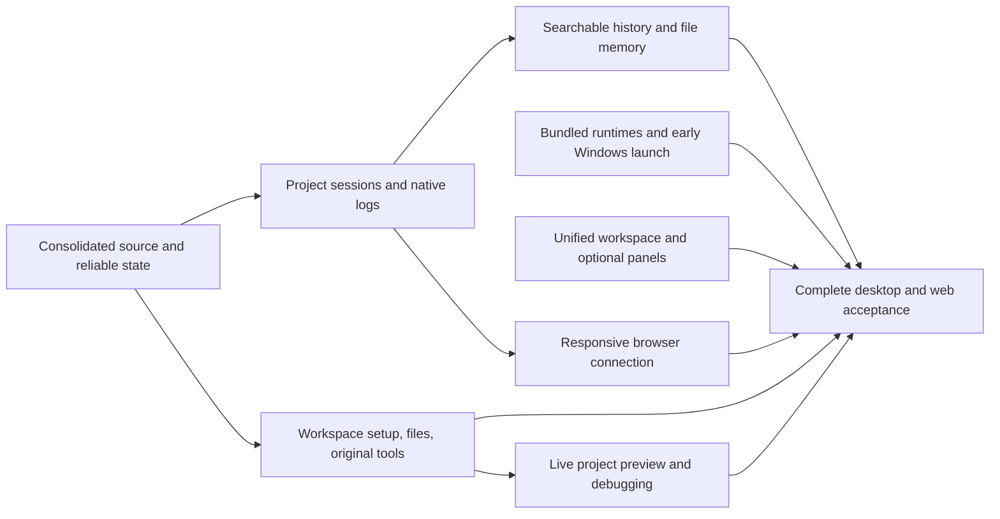

# Vivary desktop and self-hosted web release

Decision: Jeff, 2026-09-13. This is the active product delivery target.

Vivary is one agent workspace application, available through a local desktop
window and a responsive browser client. The instance runs on a user-controlled
computer or suitable self-hosted server. Agents, provider credentials, files,
history, and memory stay on that host. A phone connects as a client.

The first installed release targets Windows with a working `Vivary.exe` and its
required runtime files. Local desktop opens without a Vivary account. Remote
browser access is explicitly enabled and authenticated. Zo is the development
and private preview host, not a required service for users. Mac distribution is
optional later roadmap work, outside this active milestone.

## The finished experience

Open Vivary, create a workspace or adopt an existing folder, and start a chat in
that project. The agent can find files, retrieve relevant context, make authorized
changes, and use the original Vivary operations. Return tomorrow, reopen the same
session, search an older conversation, or start a fresh chat that recalls the
project's saved decisions. Switching projects switches the agent's context.

The Windows distribution and responsive self-hosted client must demonstrate their
complete journeys. A working window or iframe alone does not meet the target.

## One understandable model

| Concept | Meaning and owner |
| --- | --- |
| Project | A stable identity for an authorized folder, its settings, guidance, and sessions. Native-backed project registration owns the binding. |
| Session | One contained conversation in one project. It references an existing Native Code run or Full chat thread. It has a title, dates, model/runtime identity, and searchable retained messages. |
| Run | One execution or follow-up inside a session. Native owns execution, cancellation, tool activity, and results. |
| Memory | Reusable project facts and decisions in readable files, with sources and correction/removal controls. A transcript is not automatically active memory. |
| Logs | Provider-owned CLI session logs and Native execution records stored outside the user's project files. Vivary keeps references and shows them through the session. |
| Search index | A rebuildable local cache over authorized files or transcripts. Source files and Native records remain authoritative. |

Code Agent and Full chat may use different runtimes. Both must use this project
and session model in navigation and search. Existing unassigned chats must remain
accessible during migration. Do not silently attach them to an arbitrary project.

## Storage and retrieval

Project files stay where the user puts them. Preserve the original five-file
workspace contract and editable starter patterns. Ordinary memory uses configured
project files, with `.vivary/knowledge/` as the planned default for new workspaces.
The existing `.vivary/memory/` directory belongs to disposable semantic-provider
state. Authored notes must never share its cleanup or ignore rules.
Resolve the exact path through `workspace.toml` roles. Do not require a rigid role
layout, language pack, Brain service, Git, Jujutsu, Beads, or Entire to remember work.

Native owns its application database, transcripts, and run records in private
application data outside project folders. Model CLIs keep credentials and their
native logs in their supported locations. A Vivary session records the native
session reference needed to reopen or inspect that history. App-invoked original
CLI execution receipts also use private application data through VIVARY_RECEIPT_LOG.
Keep deliberate project decision/evidence records distinct from execution logs.
Never import all personal provider history into a project automatically.

Load compact project instructions and current state at each run. Retrieve relevant
memory and context when needed instead of replaying unlimited chat text. Retain full chat history until the user archives or deletes it under an explicit
retention policy. Display limits must not silently delete retained messages.
A saved fact must be available in a fresh session after restart. Correcting or forgetting
active memory must not claim to erase historical transcripts or Git history.

Exact filename, text, symbol, and regex search is required. Start with ripgrep and
existing Native tools. Return bounded file/line references, respect ignore rules
and private exclusions, and allow cancellation. Chat search must cover retained
messages beyond the latest 20 runs or 400-event display window.

[zvec-grep](https://github.com/zvec-ai/zvec-grep) is a candidate for optional ranked
and semantic retrieval. Its upstream Windows work does not prove compatibility
with this app. [11d](packets/11d-evaluate-zvec-search.md) owns the measured decision.
Keep exact search usable without a model download, semantic index, or paid API.
Store derived indexes in private application data, keyed by stable project identity.

## What exists and what is missing

| Area | Existing implementation | Required work |
| --- | --- | --- |
| Desktop | Electron, bundled Node, loopback launcher, native folder chooser, old Windows portable artifact | Bundle the original Python suite and prove the current app on Windows |
| Agent loop | Native Code execution, file tools, Stop, stored normalized transcripts | Supported provider session persistence/resume and external log references |
| Projects | Folder registration, Code project binding, selected-project state | Reliable saves, Project session acceptance, Create and Adopt workflows |
| History | Native Code transcripts and Native Full chat storage/search | One project/session presentation, Code pagination and content search |
| Memory | Original file contracts, Tropo retrieval, optional role metadata | Load, retrieve, save, correct, and forget through actual agent runs |
| Files | Small Markdown/text/JSON inspector | Source-file navigation, exact search, conflict-aware editing |
| Browser experience | Basic isolated iframe preview and the shared web UI | Explicit phone-to-host connection, responsive controls, and integrated agent debugging |
| Original Vivary | All ten CLI verbs and the recovered shared content preview | Package and connect them through deterministic Native actions |

The old Windows artifact is an unsigned portable preview from earlier source.
It does not establish a working Windows release. The repo has passed CI, but
specific broad-suite and hosted persistence failures remain in the
[salvage receipt](receipts/salvage-handoff-2026-09-12.md).

## GitHub delivery order

[Open the desktop and self-hosted web milestone](https://github.com/vivary-dev/Vivary-New/milestone/1).
The linked issues track these same packets.

GitHub issues are authoritative for task goals, acceptance, dependencies, ownership,
priority, and lifecycle. This table is a synchronized navigation snapshot. Read the
live issue before dispatch. Packets provide implementation guidance and evidence,
not a second task contract. Preserve approved product and access constraints.

Jeff selected the unified workspace design in issue #38 on 2026-09-14. The specification was reviewed and accepted on 2026-09-14, and the first unified
workspace slice merged in PR #42. The product lane now finishes project-session
binding and restoration.
Independent desktop runtime packaging remains the second lane when work resumes.
Keep one integration writer, one owner per shared file, a reviewer for completed slices, and one heavy runtime job at a
time. Independent source work can continue during CI. Close each issue only after
its accepted behavior is verified and its reviewed PR is merged.

| Order | Deliverable | Owning ticket | Readiness |
| --- | --- | --- | --- |
| 1 | Reliable state | [06g: Save project and conversation selections reliably](packets/06g-reliable-local-and-hosted-state.md) · [#5](https://github.com/vivary-dev/Vivary-New/issues/5) | Done |
| 2 | Unified project workspace | [Interaction contract](unified-workspace.md) · [#38](https://github.com/vivary-dev/Vivary-New/issues/38) | First shell merged; remaining integrations follow the accepted specification |
| 3 | Project sessions | [04a: Bind every chat session to its project](packets/04a-project-chat-sessions.md) · [#6](https://github.com/vivary-dev/Vivary-New/issues/6) | PR #43 held for Native persistence and composer fixes |
| 4 | Bundled runtime | [23a: Bundle the original Vivary command runtime](packets/23a-bundle-original-vivary-runtime.md) · [#7](https://github.com/vivary-dev/Vivary-New/issues/7) | Ready |
| 5 | Early Windows check | [23b: Make the packaged application start on Windows](packets/23b-windows-first-launch.md) · [#8](https://github.com/vivary-dev/Vivary-New/issues/8) | After 23a |
| 6 | Session continuity | [17a: Restore project chats and drafts after restart](packets/17a-chat-restart-and-drafts.md) · [#9](https://github.com/vivary-dev/Vivary-New/issues/9) | After 04a, 06g |
| 7 | Native session logs | [04c: Retain provider sessions outside project folders](packets/04c-native-provider-session-logs.md) · [#10](https://github.com/vivary-dev/Vivary-New/issues/10) | After 04a |
| 8 | Searchable chats | [04b: Search the contents of project chat sessions](packets/04b-search-chat-content.md) · [#11](https://github.com/vivary-dev/Vivary-New/issues/11) | After 04a |
| 9 | Project files | [11a: Read and edit authorized project files through the GUI](packets/11a-authorized-workspace-file-editing.md) · [#12](https://github.com/vivary-dev/Vivary-New/issues/12) | Done |
| 10 | Fast file search | [11c: Search large project trees from the application](packets/11c-fast-project-search.md) · [#13](https://github.com/vivary-dev/Vivary-New/issues/13) | Ready |
| 11 | Live preview and agent debugging | [11e: Preview and debug a running project](packets/11e-live-project-preview.md) · [#31](https://github.com/vivary-dev/Vivary-New/issues/31) | After 04a |
| 12 | Shared workspace operations | [07b: Share a file-content plan and apply path between GUI and CLI](packets/07b-shared-workspace-plan-apply.md) · [#14](https://github.com/vivary-dev/Vivary-New/issues/14) | Ready |
| 13 | GUI workspace setup | [07d: Create and open a Vivary workspace through the GUI](packets/07d-create-workspace-through-gui.md) · [#15](https://github.com/vivary-dev/Vivary-New/issues/15) | After 07b, 06g |
| 14 | Starter patterns | [07c: Compose built-in workspace patterns and reconfigure an existing project](packets/07c-builtin-patterns-reconfiguration.md) · [#16](https://github.com/vivary-dev/Vivary-New/issues/16) | After 07d |
| 15 | Existing folders | [08a: Adopt populated folders with truthful type and conflict preflight](packets/08a-populated-folder-adoption.md) · [#17](https://github.com/vivary-dev/Vivary-New/issues/17) | After 07b |
| 16 | Original context | [09a: Verify and repair narrow non-code context and Doctor behavior](packets/09a-noncode-context-doctor.md) · [#18](https://github.com/vivary-dev/Vivary-New/issues/18) | Ready |
| 17 | Original read tools | [09b: Expose original project read tools in Native](packets/09b-original-read-tools.md) · [#19](https://github.com/vivary-dev/Vivary-New/issues/19) | After 09a, 23a |
| 18 | Original review/control | [09c: Expose original review and control tools in Native](packets/09c-original-review-control-tools.md) · [#20](https://github.com/vivary-dev/Vivary-New/issues/20) | After 09b, 07d |
| 19 | File memory | [18a: Reload scoped file memory across conversations and restarts](packets/18a-scoped-file-memory.md) · [#21](https://github.com/vivary-dev/Vivary-New/issues/21) | After 04a, 11a, 09b |
| 20 | Release regressions | [06h: Make the maintained application regression checks reliable](packets/06h-maintained-application-regressions.md) · [#22](https://github.com/vivary-dev/Vivary-New/issues/22) | Ready |
| 21 | Self-hosted browser access | [23d: Connect a responsive browser](packets/23d-self-hosted-browser-access.md) · [#30](https://github.com/vivary-dev/Vivary-New/issues/30) | After 06g, 04a, 17a |
| 22 | Desktop and web acceptance | [23c: Deliver and accept the desktop and web product](packets/23c-windows-product-acceptance.md) · [#23](https://github.com/vivary-dev/Vivary-New/issues/23) | After 06g, 06h, 04b, 04c, 17a, 18a, 07c, 08a, 11a, 11c, 09b, 09c, 23b, 23d, 11e, #35, #38 |
| 23 | Optional semantic search | [11d: Evaluate optional local semantic search](packets/11d-evaluate-zvec-search.md) · [#24](https://github.com/vivary-dev/Vivary-New/issues/24) | After 11c |

[Issue #35](https://github.com/vivary-dev/Vivary-New/issues/35) adds explicit
approval and denial for background agent work to final product acceptance.
It is required in the desktop and self-hosted web milestone. Each approved turn
must remain visible and reopenable after browser navigation.

The first Windows launch check happens before final acceptance, so platform
failures are discovered while product implementation continues. The final release
ticket is not complete until its whole user journey passes on the exact artifact.

The delivery table and additional background-work issue identify the required
implementation and acceptance scope. Semantic search remains an optional
evaluation outside the release milestone. Several required tickets extend
existing code. This is substantial integration work, not one packaging command. Do not publish a percentage or a completion date
from historical packet counts. Reassess the remaining work after the first Windows
launch and the project-session checks expose their actual compatibility limits.

## Acceptance journey

1. Install or extract the versioned distribution on Windows and launch `Vivary.exe`
   without a source checkout, global Node, global Python, or a Vivary account.
2. Connect a supported model, create one workspace, and adopt another populated
   folder without replacing its files. Inspect the generated guidance.
3. Start separate sessions in both projects. Run an authorized file change and
   inspect its tool output, diff, native session reference, and external log location.
4. Save a project fact. Restart the app, open a fresh session, and retrieve that
   fact. Correct it and remove it from active memory. Verify project isolation.
5. Find an old chat by message content, open the matching session and message,
   and continue it. Preserve titles, drafts, selected project, and history.
6. Search a representative large codebase by filename, exact text, and regex.
   Edit a supported file, detect an external edit, and resolve the conflict safely.
7. Use all original CLI verbs through the installed shared operations: `create`,
   `adopt`, `doctor`, `capabilities`, `find`, `check`, `decide`, `review`, `impact`,
   and `control`. Preserve their policy decisions and headless behavior.
8. Stop a running agent, close Vivary, and verify owned processes stop. Reopen
   after an interrupted run and show an accurate recoverable state.
9. Verify the distribution's version, licenses, runtime closure, checksum, and
   upgrade/removal behavior. Preserve user projects and private application data.
10. Connect desktop and phone browsers to the same explicitly selected private
    instance. Verify authentication, revocation, reconnect, responsive controls,
    and host-side project/session identity. Phone use does not run agents locally.
11. Open a project's live page, inspect a visible or console-reported error through
    supported agent browser tools, make an authorized repair, and confirm the
    corrected preview. Keep preview content isolated from privileged app state.

Use completed hosted flows before the corresponding laptop checks. A hosted
access failure does not justify weakening authentication or blocking unrelated
source work. Run focused checks for each ticket and repeat only affected journeys.
Keep the final Windows result separate from cross-packaging and Linux evidence.

## One backlog and one integration branch

GitHub milestone issues own the work and its acceptance. Documents explain the
implementation and preserve evidence. Update the live issue first when Jeff changes
task scope, then reconcile its supporting packet and generated views. Do not keep
conflicting task status in Markdown or derive a new queue from historical labels.
The existing 36 outcomes remain the coverage map. They are not 36 simultaneous
workstreams and are not a second active desktop backlog.

Typed topic PRs integrate reviewed work into `dev`. Reviewed product milestones
promote to `main` after Jeff's acceptance. Useful source changes are merged.
Failed experiments are not reintroduced to make history look complete. Preserve
the salvage branch and dated receipts. Do not leave duplicate active PRs or
competing roadmap instructions after consolidating a change.

The original CLI capability set belongs in this desktop release. The larger
factory, delegated research, email intake, public service/discovery, and pilot
outcomes remain subsequent milestones of the same product. Project merge/split,
generated views, and the held external pattern catalog retain their existing
packets. They are not silently deleted or required to open and use the desktop.
Public release, signing credentials, paid services, and external account changes
retain their specific authorization requirements.
