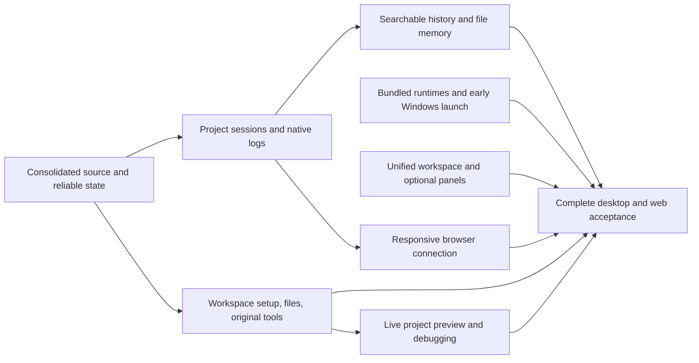

# Vivary desktop and self-hosted web release

Decision: Jeff, 2026-09-13. This is the active product delivery target.

Vivary is one agent workspace application, available through a local desktop
window and a responsive browser client. The instance runs on a user-controlled
computer or suitable self-hosted server. Agents, provider credentials, files,
history, and memory stay on that host. A phone connects as a client.

The first installed release targets Windows with a working `Vivary.exe` and its
required runtime files. Local desktop opens without a Vivary account. Remote
browser access is explicitly enabled and authenticated. Zo is the development
and private preview host, not a required service for users. Mac distribution is
optional later roadmap work, outside this active milestone.

## The finished experience

Open Vivary, create a workspace or adopt an existing folder, and start a chat in
that project. The agent can find files, retrieve relevant context, make authorized
changes, and use the original Vivary operations. Return tomorrow, reopen the same
session, search an older conversation, or start a fresh chat that recalls the
project's saved decisions. Switching projects switches the agent's context.

The Windows distribution and responsive self-hosted client must demonstrate their
complete journeys. A working window or iframe alone does not meet the target.

## One understandable model

| Concept | Meaning and owner |
| --- | --- |
| Project | A stable identity for an authorized folder, its settings, guidance, and sessions. Native-backed project registration owns the binding. |
| Session | One contained conversation in one project. It references an existing Native Code run or Native chat thread. It has a title, dates, model/runtime identity, and searchable retained messages. |
| Run | One execution or follow-up inside a session. Native owns execution, cancellation, tool activity, and results. |
| Memory | Reusable project facts and decisions in readable files, with sources and correction/removal controls. A transcript is not automatically active memory. |
| Logs | Provider-owned CLI session logs and Native execution records stored outside the user's project files. Vivary keeps references and shows them through the session. |
| Search index | A rebuildable local cache over authorized files or transcripts. Source files and Native records remain authoritative. |

Code and Native conversations may use different runtimes. Both must use this project
and session model in navigation and search. Existing unassigned chats must remain
accessible during migration. Do not silently attach them to an arbitrary project.

## Storage and retrieval

Project files stay where the user puts them. Preserve the original five-file
workspace contract and editable starter patterns. Ordinary memory uses configured
project files, with `.vivary/knowledge/` as the planned default for new workspaces.
The existing `.vivary/memory/` directory belongs to disposable semantic-provider
state. Authored notes must never share its cleanup or ignore rules.
Resolve the exact path through `workspace.toml` roles. Do not require a rigid role
layout, language pack, Brain service, Git, Jujutsu, Beads, or Entire to remember work.

Native owns its application database, transcripts, and run records in private
application data outside project folders. Model CLIs keep credentials and their
native logs in their supported locations. A Vivary session records the native
session reference needed to reopen or inspect that history. App-invoked original
CLI execution receipts also use private application data through VIVARY_RECEIPT_LOG.
Keep deliberate project decision/evidence records distinct from execution logs.
Never import all personal provider history into a project automatically.

Load compact project instructions and current state at each run. Retrieve relevant
memory and context when needed instead of replaying unlimited chat text. Retain full chat history until the user archives or deletes it under an explicit
retention policy. Display limits must not silently delete retained messages.
A saved fact must be available in a fresh session after restart. Correcting or forgetting
active memory must not claim to erase historical transcripts or Git history.

Exact filename, text, symbol, and regex search is required. Start with ripgrep and
existing Native tools. Return bounded file/line references, respect ignore rules
and private exclusions, and allow cancellation. Chat search must cover retained
messages beyond the latest 20 runs or 400-event display window.

[zvec-grep](https://github.com/zvec-ai/zvec-grep) is a candidate for optional ranked
and semantic retrieval. Its upstream Windows work does not prove compatibility
with this app. [11d](packets/11d-evaluate-zvec-search.md) owns the measured decision.
Keep exact search usable without a model download, semantic index, or paid API.
Store derived indexes in private application data, keyed by stable project identity.

## What exists and what is missing

See the [current desktop acceptance register](desktop-acceptance-status.md) for the tested artifact, fixed defects, and explicit proof gaps.

| Area | Existing implementation | Required work |
| --- | --- | --- |
| Desktop | Private candidates passed Explorer extraction/launch, packaged runtime use, second-instance reuse, restart continuity, and cleanup | Clean-profile setup, upgrade/removal behavior, and final desktop/web acceptance |
| Agent loop | Windows Codex file work, session continuity, native action decisions, subagent cards, long commands, active-command Stop, and shutdown. Remote permission-setting and retained activity checks | Broader cross-runtime integration, real Native-provider turns, automation execution, and external provider-log acceptance |
| Projects | Registration, saved selection, and shared creator operations. Issues #15 and #17 passed their qualified creation, reconnect, and adoption journeys. Issue #16 passed hosted composition and reconfiguration | Remaining parent packet 08 scope and final artifact acceptance under #23 |
| History | Retained Code transcripts, Native storage, one central workspace, and hosted Native and Code draft restoration on `250b402f` | Packaged #9 draft and close acceptance, pagination, and content search |
| Memory | Original file contracts, Tropo retrieval, optional role metadata | Load, retrieve, save, correct, and forget through actual agent runs |
| Files | Tree navigation, formatted reading, explicit Edit/Save/Rename, conflict recovery | Exact file search and broader file capabilities under their owning issues |
| Browser experience | [Issue #31](receipts/11e-live-project-preview.md) verifies reviewed project commands, isolated live preview, responsive controls, and real agent repair on Zo | Explicit authenticated phone routing, packaged preview journeys, and supported agent image viewing |
| Original Vivary | Bundled ten-verb standalone CLI, bounded preview/evaluation app adapter, and issue #14's shared new-folder and existing-folder creator operations | GUI and agent use of the remaining original operations under their owning issues |

Checkpoint, 2026-09-16: the published private `26798df` Windows candidate passed
the focused journeys in the [acceptance register](desktop-acceptance-status.md).
The later local `3dd5aa8` candidate verified Codex subscription model selection,
file work, native-session follow-up, Stop, and cleanup. Those results predate the
replacement native action approvals, permission modes, and activity cards.

Candidate `2f4a5df` passed its Zo production build, 70 focused tests, 12 Native
regressions, and type checking. The real Astra journey displayed one actual child
and its public result after reopening on desktop and narrow layouts. The simulated
protocol UI journey covered native decisions/forms, activity persistence, an open
card surviving the live-to-history remount, and cross-project Stop after 125.15
seconds. The acceptance register separates real model evidence from fixture proof.

The replacement Windows archive has been downloaded, hash-verified, and launched.
The exact EXE verified file work, existing native-session continuation, a configured
MCP call, an actual child card and public result, and a 125.19-second command.
After the unintended Escape pause, resumed Windows QA verified native Allow once
and Decline against actual files. Cross-project Stop ended an observed running
command, and its delayed file stayed absent beyond 90 seconds. Closing the EXE
removed its candidate processes.

Read only completed a real read and an OS-denied write, leaving its output absent.
YOLO wrote and read an authorized fixture outside the project without an approval
prompt. The mode setting survived restart, and Normal was restored.

Final source `98515c9` fixes overlapping tool identity and pending-approval display,
including the API phase missing from the first correction. Its production build,
75 focused tests, and type checking passed. The 12 unchanged Native regressions
also passed. Hosted QA held and reloaded a pending request without a false stopped
warning, then received the final answer. The hash-verified replacement EXE passed
the same affected journey with a real approved file write and retained output.

This accepts the bounded Codex prototype flows tested across the recorded candidates.
The final EXE retest does not repeat the entire earlier Windows journey. Final
restart and shutdown passed, and superseded local packages were removed. The private preview
serves `98515c9` with its authentication boundary preserved.
[PR #59](https://github.com/vivary-dev/Vivary-New/pull/59) merged into `dev` as
`b81dcd7` on 2026-09-16. Its tree matches the `f21328b` head that passed all 62
applicable Linux workflow steps on Zo. GitHub and Entire both received the merge.
GitHub Actions did not start because of billing; Windows workflow jobs remain
unrun. The published `26798df` archive is unchanged.
Real Native-provider turns, automations, OpenCode and broader cross-runtime work,
clean-profile setup, and the remaining table entries stay open.

Checkpoint, 2026-09-18: local candidate `43ae417` (merged `dev` after PR #66, not
published) passed the packaged-EXE journey on the laptop, including the new
project-health step with output identical to headless Doctor. Approval and denial
were not rerun on it and remain proven on `98515c9` with Codex Normal mode. The
[acceptance register](desktop-acceptance-status.md) has the per-step table. The
published `26798df` archive is unchanged.

The private preview includes PR #43's maintained Native repair. Its saved-head
and composer journeys pass. Legacy bookmarks and Native history controls also
pass. PR #43 records the owner-approved Zo CI and integration result. Earlier failure receipts are dated
evidence, not the current source or release status. Recheck folder availability
before each hosted journey. Previous successful bindings can become unavailable.

## GitHub delivery order

[Open the desktop and self-hosted web milestone](https://github.com/vivary-dev/Vivary-New/milestone/1).
The linked issues track these same packets.

GitHub issues are authoritative for task goals, acceptance, dependencies, ownership,
priority, and lifecycle. This table is a synchronized navigation snapshot. Read the
live issue before dispatch. Packets provide implementation guidance and evidence,
not a second task contract. Preserve approved product and access constraints.

Jeff selected the unified workspace design in issue #38 on 2026-09-14. The specification was reviewed and accepted on 2026-09-14, and the first unified
workspace slice merged in PR #42. The product lane now finishes project-session
binding and restoration.
The original-runtime packaging slice merged in PR #44; issue #8 owns the
actual Windows first launch.
Keep one integration writer, one owner per shared file, a reviewer for completed slices, and one heavy runtime job at a
time. Independent source work can continue during CI. Close each issue only after
its accepted behavior is verified and its reviewed PR is merged.

| Order | Deliverable | Owning ticket | Readiness |
| --- | --- | --- | --- |
| 1 | Reliable state | [06g: Save project and conversation selections reliably](packets/06g-reliable-local-and-hosted-state.md) · [#5](https://github.com/vivary-dev/Vivary-New/issues/5) | Done |
| 2 | Unified project workspace | [Interaction contract](unified-workspace.md) · [#38](https://github.com/vivary-dev/Vivary-New/issues/38) | First shell merged; remaining integrations follow the accepted specification |
| 3 | Project sessions | [04a: Bind every chat session to its project](packets/04a-project-chat-sessions.md) · [#6](https://github.com/vivary-dev/Vivary-New/issues/6) | Done. Verified Native repair, legacy bookmarks, and history controls. PR #43 records integration |
| 4 | Bundled runtime | [23a: Bundle the original Vivary command runtime](packets/23a-bundle-original-vivary-runtime.md) · [#7](https://github.com/vivary-dev/Vivary-New/issues/7) | Done: PR #44 merged into dev and issue closed. The governed original-command app adapter remains preview-only for create/adopt. The managed New Project and existing-folder creator paths passed #14 acceptance. Issue #15 passed its hosted and affected packaged Windows GUI journeys. Packaged Windows first launch passed #8 |
| 5 | Early Windows check | [23b: Make the packaged application start on Windows](packets/23b-windows-first-launch.md) · [#8](https://github.com/vivary-dev/Vivary-New/issues/8) | Private candidate passed focused Windows acceptance; issue lifecycle and integration remain with GitHub |
| 6 | Session continuity | [17a: Restore project chats and drafts after restart](packets/17a-chat-restart-and-drafts.md) · [#9](https://github.com/vivary-dev/Vivary-New/issues/9) | Hosted journey passed on `250b402f`; packaged EXE close and keyboard proof pending |
| 7 | Native session logs | [04c: Retain provider sessions outside project folders](packets/04c-native-provider-session-logs.md) · [#10](https://github.com/vivary-dev/Vivary-New/issues/10) | After 04a |
| 8 | Searchable chats | [04b: Search the contents of project chat sessions](packets/04b-search-chat-content.md) · [#11](https://github.com/vivary-dev/Vivary-New/issues/11) | After 04a |
| 9 | Project files | [11a: Read and edit authorized project files through the GUI](packets/11a-authorized-workspace-file-editing.md) · [#12](https://github.com/vivary-dev/Vivary-New/issues/12) | Done |
| 10 | Fast file search | [11c: Search large project trees from the application](packets/11c-fast-project-search.md) · [#13](https://github.com/vivary-dev/Vivary-New/issues/13) | Done: PRs #63 and #64 merged into dev and accepted 2026-09-18. Exact filename, text, and regex search with bounded pages and open-at-line; agent search stays harness-owned |
| 11 | Live preview and agent debugging | [11e: Preview and debug a running project](packets/11e-live-project-preview.md) · [#31](https://github.com/vivary-dev/Vivary-New/issues/31) | Hosted acceptance passed. See the receipt for remaining platform limits |
| 12 | Shared workspace operations | [07b: Share a file-content plan and apply path between GUI and CLI](packets/07b-shared-workspace-plan-apply.md) · [#14](https://github.com/vivary-dev/Vivary-New/issues/14) | Done: PR #47's new-folder plan/apply carried forward. Current normal-app Native/CLI existing-folder parity, refusal, replay, and recovery checks passed. The `df4aedc` package passed the affected Windows GUI journey. See the [#14 receipt](receipts/07b-shared-workspace-plan-apply.md) |
| 13 | GUI workspace setup | [07d: Create and open a Vivary workspace through the GUI](packets/07d-create-workspace-through-gui.md) · [#15](https://github.com/vivary-dev/Vivary-New/issues/15) | The exact `27499cf` build passed hosted managed Create, existing-folder setup, explicit external reconnect, phone-width review, files, and restart. Its unpublished Windows EXE passed managed creation, native folder selection, explicit reconnect, and restart. Earlier managed recovery passed in PRs #45 and #46. The [#15 receipt](receipts/07d-gui-workspace-creation.md) records limits. PR #85 merged and the issue closed |
| 14 | Starter patterns | [07c: Compose built-in workspace patterns and reconfigure an existing project](packets/07c-builtin-patterns-reconfiguration.md) · [#16](https://github.com/vivary-dev/Vivary-New/issues/16) | Accepted on `7784b8d9` through installed-runtime and hosted desktop/narrow checks, with legacy and Unicode compatibility verified on `1ae19565`. Includes edited guidance, changed preview, retry, and restart. See the [#16 receipt](receipts/07c-builtin-patterns-reconfiguration.md). Final packaged acceptance remains under #23 |
| 15 | Existing folders | [08a: Adopt populated folders with truthful type and conflict preflight](packets/08a-populated-folder-adoption.md) · [#17](https://github.com/vivary-dev/Vivary-New/issues/17) | Accepted on `2d620af` through hosted proof and Windows CI, with qualified packaged `f024979` integration evidence. See the [#17 receipt](receipts/08a-populated-folder-adoption.md). Parent packet 08 remains open |
| 16 | Original context | [09a: Verify and repair narrow non-code context and Doctor behavior](packets/09a-noncode-context-doctor.md) · [#18](https://github.com/vivary-dev/Vivary-New/issues/18) | Done: PR #66 merged into dev and accepted 2026-09-18. Doctor keeps warning severity, npm facts only with a manifest, and Project details checks health on demand |
| 17 | Original read tools | [09b: Expose original project read tools in Native](packets/09b-original-read-tools.md) · [#19](https://github.com/vivary-dev/Vivary-New/issues/19) | After 09a, 23a |
| 18 | Original review/control | [09c: Expose original review and control tools in Native](packets/09c-original-review-control-tools.md) · [#20](https://github.com/vivary-dev/Vivary-New/issues/20) | After 09b, 07d |
| 19 | File memory | [18a: Reload scoped file memory across conversations and restarts](packets/18a-scoped-file-memory.md) · [#21](https://github.com/vivary-dev/Vivary-New/issues/21) | After 04a, 11a, 09b |
| 20 | Release regressions | [06h: Make the maintained application regression checks reliable](packets/06h-maintained-application-regressions.md) · [#22](https://github.com/vivary-dev/Vivary-New/issues/22) | Done: PR #62 merged into dev and accepted 2026-09-18. `test:maintained` runs in CI |
| 21 | Self-hosted browser access | [23d: Connect a responsive browser](packets/23d-self-hosted-browser-access.md) · [#30](https://github.com/vivary-dev/Vivary-New/issues/30) | After 06g, 04a, 17a |
| 22 | Desktop and web acceptance | [23c: Deliver and accept the desktop and web product](packets/23c-windows-product-acceptance.md) · [#23](https://github.com/vivary-dev/Vivary-New/issues/23) | After 06g, 06h, 04b, 04c, 17a, 18a, 07c, 08a, 11a, 11c, 09b, 09c, 23b, 23d, 11e, #35, #38 |
| 23 | Optional semantic search | [11d: Evaluate optional local semantic search](packets/11d-evaluate-zvec-search.md) · [#24](https://github.com/vivary-dev/Vivary-New/issues/24) | After 11c |

[Issue #35](https://github.com/vivary-dev/Vivary-New/issues/35) adds explicit
approval and denial for background agent work to final product acceptance.
It is required in the desktop and self-hosted web milestone. Each approved turn
must remain visible and reopenable after browser navigation.

[Issue #50](https://github.com/vivary-dev/Vivary-New/issues/50) owns real Native-provider
access and real-provider turns in the packaged Windows app. [Issue #51](https://github.com/vivary-dev/Vivary-New/issues/51)
owns automation creation, execution, restart recovery, and lifecycle acceptance and is
blocked on #50. [Issue #38](https://github.com/vivary-dev/Vivary-New/issues/38) retains
linked conversations and broader cross-runtime integration, including OpenCode.
Its Codex catalog and tool increment has separate evidence in the acceptance register.

The first Windows launch check happens before final acceptance, so platform
failures are discovered while product implementation continues. The final release
ticket is not complete until its whole user journey passes on the exact artifact.

The delivery table and additional background-work issue identify the required
implementation and acceptance scope. Semantic search remains an optional
evaluation outside the release milestone. Several required tickets extend
existing code. This is substantial integration work, not one packaging command. Do not publish a percentage or a completion date
from historical packet counts. Reassess the remaining work after the first Windows
launch and the project-session checks expose their actual compatibility limits.

## Acceptance journey

1. Install or extract the versioned distribution on Windows and launch `Vivary.exe`
   without a source checkout, global Node, global Python, or a Vivary account.
2. Connect a supported model, create one workspace, and adopt another populated
   folder without replacing its files. Inspect the generated guidance.
3. Start separate sessions in both projects. Run an authorized file change and
   inspect its tool output, diff, native session reference, and external log location.
4. Save a project fact. Restart the app, open a fresh session, and retrieve that
   fact. Correct it and remove it from active memory. Verify project isolation.
5. Find an old chat by message content, open the matching session and message,
   and continue it. Preserve titles, drafts, selected project, and history.
6. Search a representative large codebase by filename, exact text, and regex.
   Edit a supported file, detect an external edit, and resolve the conflict safely.
7. Use all original CLI verbs through the installed shared operations: `create`,
   `adopt`, `doctor`, `capabilities`, `find`, `check`, `decide`, `review`, `impact`,
   and `control`. Preserve their policy decisions and headless behavior.
8. Stop a running agent, close Vivary, and verify owned processes stop. Reopen
   after an interrupted run and show an accurate recoverable state.
9. Verify the distribution's version, licenses, runtime closure, checksum, and
   upgrade/removal behavior. Preserve user projects and private application data.
10. Connect desktop and phone browsers to the same explicitly selected private
    instance. Verify authentication, revocation, reconnect, responsive controls,
    and host-side project/session identity. Phone use does not run agents locally.
11. Open a project's live page, inspect a visible or console-reported error through
    supported agent browser tools, make an authorized repair, and confirm the
    corrected preview. Keep preview content isolated from privileged app state.

Use completed hosted flows before the corresponding laptop checks. A hosted
access failure does not justify weakening authentication or blocking unrelated
source work. Run focused checks for each ticket and repeat only affected journeys.
Keep the final Windows result separate from cross-packaging and Linux evidence.

## One backlog and one integration branch

GitHub milestone issues own the work and its acceptance. Documents explain the
implementation and preserve evidence. Update the live issue first when Jeff changes
task scope, then reconcile its supporting packet and generated views. Do not keep
conflicting task status in Markdown or derive a new queue from historical labels.
The existing 36 outcomes remain the coverage map. They are not 36 simultaneous
workstreams and are not a second active desktop backlog.

Typed topic PRs integrate reviewed work into `dev`. Reviewed product milestones
promote to `main` after Jeff's acceptance. Useful source changes are merged.
Failed experiments are not reintroduced to make history look complete. Preserve
the salvage branch and dated receipts. Do not leave duplicate active PRs or
competing roadmap instructions after consolidating a change.

The original CLI capability set belongs in this desktop release. The larger
factory, delegated research, email intake, public service/discovery, and pilot
outcomes remain subsequent milestones of the same product. Project merge/split,
generated views, and the held external pattern catalog retain their existing
packets. They are not silently deleted or required to open and use the desktop.
Public release, signing credentials, paid services, and external account changes
retain their specific authorization requirements.
