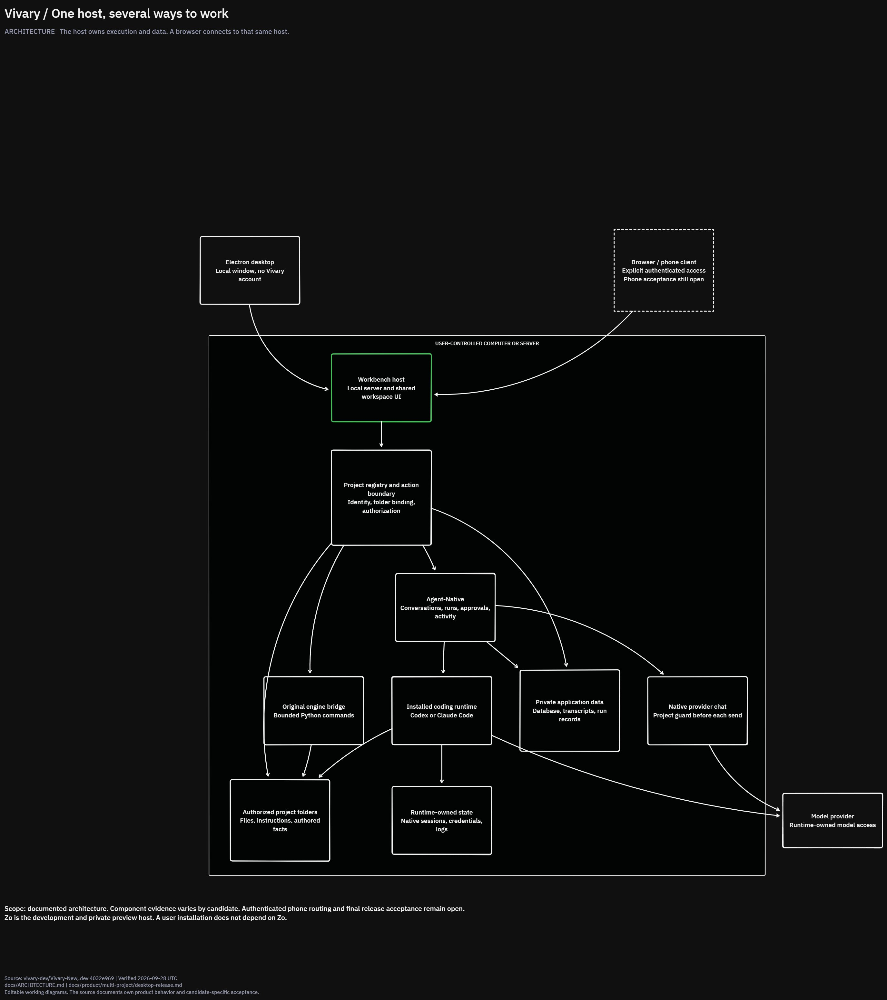
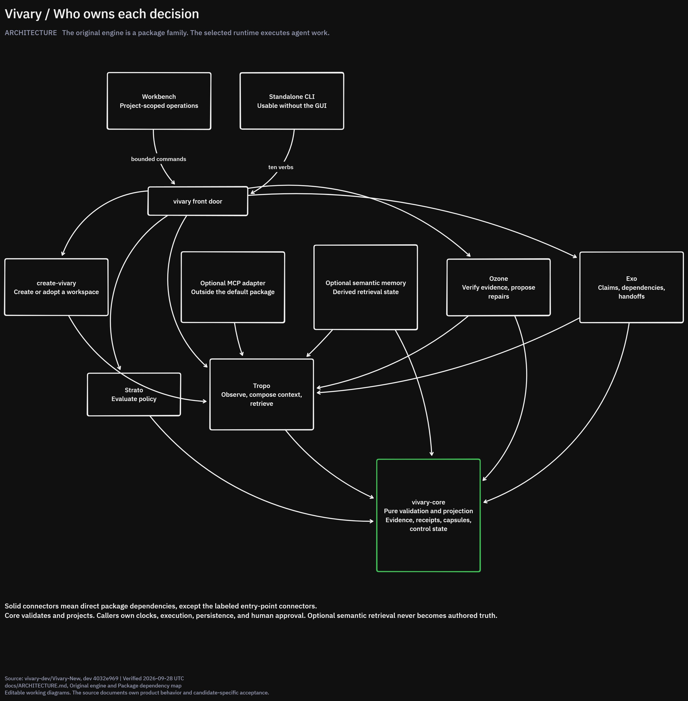
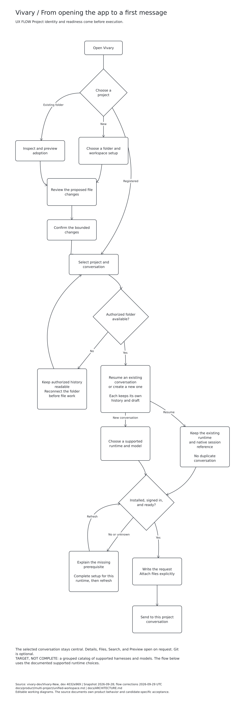
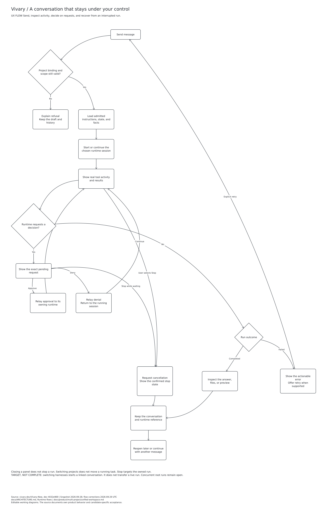
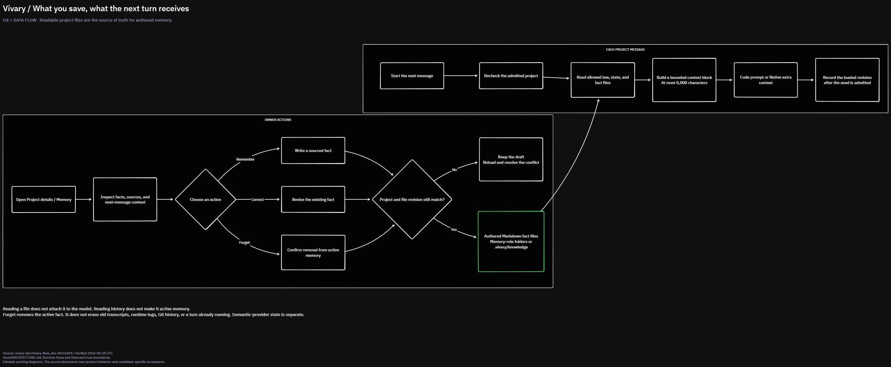
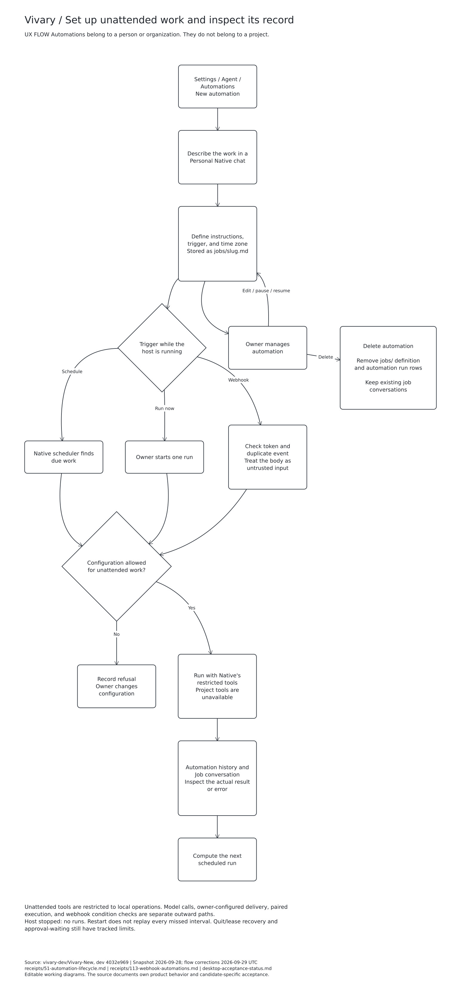

# Architecture and UX diagrams

Snapshot of `dev` at `4032e969cd6bafd3061c29508850c7013f714c1a`, prepared on 2026-09-28 UTC.
The [canonical architecture](../../../ARCHITECTURE.md) and its linked contracts own product behavior and acceptance status.
These diagrams distinguish the documented design from unfinished capabilities. They do not establish release acceptance.

Download [the editable tldraw document](vivary-architecture-and-ux.tldraw) and open it in tldraw Desktop.
Its page menu contains the six diagrams below. All 104 arrows remain bound at both ends.
The original six pages passed tldraw layout and connector lint checks on 2026-09-28.
On 2026-09-29, pages 03, 04, and 06 were corrected and re-rendered from the document's shape and binding records.
The edited records passed tldraw schema migration/validation and connector/flow checks;
the three updated images were visually checked. Desktop layout lint was not rerun.

Sources: [architecture](../../../ARCHITECTURE.md), [workspace interactions](../unified-workspace.md),
[desktop release](../desktop-release.md), [automation lifecycle](../receipts/51-automation-lifecycle.md),
[webhook automations](../receipts/113-webhook-automations.md), and [acceptance register](../desktop-acceptance-status.md).

## 01. System architecture

## 02. Engine ownership

## Review corrections (2026-09-29)

- Resume preserves the existing runtime and native session reference; only a new conversation chooses a runtime
- Denial returns to running activity, rather than declaring a terminal run outcome
- Stop remains available from the pending-request state
- Delete removes the automation definition and run rows and ends that lifecycle, while existing job conversations remain

These corrections preserve the dated snapshot; they are not a full refresh to the latest development state.

## 03. Start a project

## 04. Work and recover

## 05. Files and memory

## 06. Automation lifecycle

