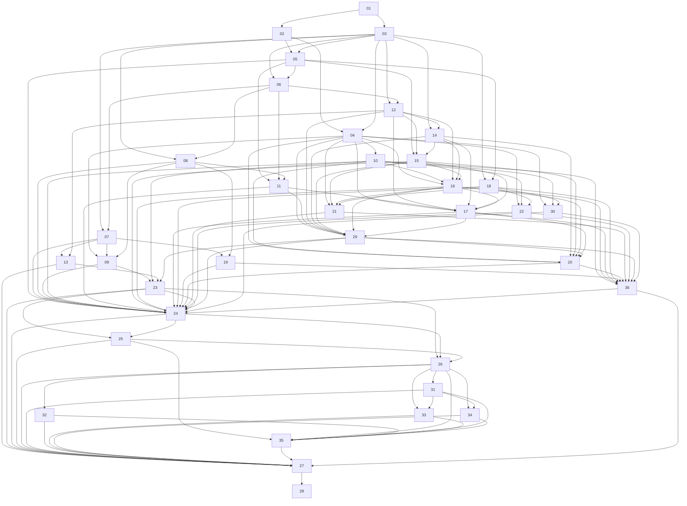

# Vivary multi-project ticket graph

Generated from outcome contracts and execution packets. Do not edit this file.

Read [the design](design.md), [execution rules](execution-contract.md),
[scope coverage](capability-matrix.md), and [current risks](audit.md).

The 36 numbered outcomes preserve the complete product. Their dependencies
gate completion. Agents execute bounded packets; a future feature or release
decision does not block an independent packet. Packet dependencies gate starts.

Frontier: none.
In progress: 05b, 06e, 17b, 20a, 24c.

## Execution packets

| Packet | Parent | Status | Start dependencies |
| --- | --- | --- | --- |
| [02a: Define the preservation manifest and restore acceptance fixtures](packets/02a-source-preservation-fixture.md) | 02 | done | [] |
| [02b: Implement and execute the synthetic restoration harness](packets/02b-restore-fixture-harness.md) | 02 | done | [02a, 10c] |
| [02c: Preserve and restore the selected native-host source](packets/02c-source-preservation.md) | 02 | done | [02b, 10c] |
| [03a: Define the portable registry contract and acceptance fixtures](packets/03a-project-registry-contract.md) | 03 | done | [] |
| [03b: Execute the portable registry contract against a deterministic model](packets/03b-registry-contract-model.md) | 03 | done | [03a, 10c] |
| [03c: Map registry transactions to native application seams](packets/03c-registry-transaction-mapping.md) | 03 | done | [03b] |
| [03d: Preserve VCS consistency on registry replay and duplicate registration](packets/03d-vcs-replay-consistency.md) | 03 | done | [12f, 03c, 06a, 06b] |
| [04a: Show current runtime readiness for the selected project](packets/04a-project-runtime-readiness.md) | 04 | done | [03c, 05a, 06d] |
| [04b: Read Native run activity for an exact project binding](packets/04b-project-native-activity.md) | 04 | done | [04a] |
| [04c: Prepare a project session with a durable intent and exact Native thread](packets/04c-project-native-preparation.md) | 04 | done | [04b, 07e, 07f] |
| [04d: Admit one synthetic Native first start from an exact preparation](packets/04d-project-native-start.md) | 04 | done | [04c] |
| [05a: Preserve and compose the native workbench shell](packets/05a-workbench-shell.md) | 05 | done | [02c, 03c] |
| [05b: Generate native chat titles with DeepSeek](packets/05b-deepseek-chat-titles.md) | 05 | in-progress | [05a] |
| [06a: Persist native registry registration transactions](packets/06a-native-registry-storage.md) | 06 | done | [03c] |
| [06b: Compose internal native registry actions](packets/06b-native-registry-actions.md) | 06 | done | [06a, 03c] |
| [06c: Validate raw registration requests at the native HTTP mount](packets/06c-native-registry-http.md) | 06 | done | [06b, 03c] |
| [06d: Register real roots through native policy and live custody](packets/06d-native-root-registration.md) | 06 | done | [06c, 12d, 05a] |
| [06e: Register and select authorized projects in the workbench](packets/06e-project-selection.md) | 06 | in-progress | [05a, 06d] |
| [07a: Preview exact thin workspace creation bytes](packets/07a-thin-init-preview.md) | 07 | done | [03c, 05a, 06d] |
| [07b: Bind creation authority to live parent custody](packets/07b-creation-parent-authority.md) | 07 | done | [03c, 06d, 07a, 12d] |
| [07c: Persist creation intent in the existing receipt owner](packets/07c-creation-receipts.md) | 07 | done | [06d, 07a, 07b] |
| [07d: Implement staged creation under protected namespace custody](packets/07d-staged-creation-effects.md) | 07 | done | [07a, 07b, 07c] |
| [07e: Compose private Native creation snapshots and effect admission](packets/07e-native-creation-admission.md) | 07 | done | [07c, 07d] |
| [07f: Keep creation effects inside correlated Native admission](packets/07f-creation-duplex-bridge.md) | 07 | done | [07d, 07e] |
| [10a: Establish the BrowserPod compatibility boundary](packets/10a-browserpod-compatibility-preflight.md) | 10 | done | [] |
| [10b: Prove the first BrowserPod toolchain on a disposable fixture](packets/10b-browserpod-toolchain-proof.md) | 10 | needs-info | [10a] |
| [10c: Prove the authorized Habitat fallback toolchain](packets/10c-habitat-fallback-proof.md) | 10 | done | [10a] |
| [12a: Define the trusted root and VCS observation boundary](packets/12a-root-vcs-observation-contract.md) | 12 | done | [03c] |
| [12b: Observe physical roots within a verified Linux observer lifetime](packets/12b-physical-root-observer.md) | 12 | done | [12a] |
| [12c: Compose physical captures with registry read observations](packets/12c-registry-read-observation.md) | 12 | done | [03c, 12b] |
| [12d: Preserve root records while tracking live identity custody](packets/12d-root-identity-lifecycle.md) | 12 | done | [12b, 12c] |
| [12e: Preserve application VCS references under live lifecycle custody](packets/12e-vcs-identity-lifecycle.md) | 12 | done | [12d] |
| [12f: Map application VCS references through the Native registry boundary](packets/12f-native-vcs-mapping.md) | 12 | done | [12e, 03c, 06d] |
| [12g: Carry live application Git references into Native registration](packets/12g-native-vcs-registration.md) | 12 | done | [12f, 03d, 12e, 06d] |
| [12h: Persist bounded mutation admission](packets/12h-durable-mutation-admission.md) | 12 | done | [12g, 03d, 12e, 06d] |
| [17a: Quarantine a durable mutation admission](packets/17a-quarantine-mutation.md) | 17 | done | [12h, 06d, 03d] |
| [17b: Read durable mutation recovery state](packets/17b-recovery-state-read.md) | 17 | in-progress | [17a, 12h] |
| [20a: Prove the Claude Code headless loop on files](packets/20a-headless-loop-proof.md) | 20 | in-progress | [10c, 20c] |
| [20c: Prepare the deterministic headless loop proof](packets/20c-headless-loop-preparation.md) | 20 | done | [10c] |
| [20d: Repair the environment and simplify the development process](packets/20d-process-environment-maintenance.md) | 20 | done | [10c] |
| [20e: Resolve the native usage-policy mismatch](packets/20e-native-usage-policy.md) | 20 | done | [10c, 20c] |
| [20f: Prove a configurable resource profile without model calls](packets/20f-runtime-resource-profile.md) | 20 | done | [10c, 20c] |
| [20g: Reap exited adopted children before process acceptance](packets/20g-exited-child-reaping.md) | 20 | done | [10c, 20c] |
| [20h: Verify natural settlement for handled child statuses](packets/20h-expected-status-settlement.md) | 20 | done | [20f] |
| [20j: Compose shipped creation and planner context](packets/20j-shipped-creation-and-context.md) | 20 | needs-info | [07f, 20c] |
| [20k: Gate developer stages through shipped Strato decisions](packets/20k-shipped-developer-decision.md) | 20 | needs-info | [20j] |
| [24a: Index canonical sources and module ownership](packets/24a-source-module-navigation.md) | 24 | done | [12a] |
| [24b: Enforce typed program records without changing graph meaning](packets/24b-program-record-knowledge-format.md) | 24 | done | [24a] |
| [24c: Inspect and exercise pinned Zvec direct search](packets/24c-zg-direct-search.md) | 24 | in-progress | [24b] |

## Product outcomes

| Outcome | Status | Completion dependencies |
| --- | --- | --- |
| [01: Reconcile migration provenance and product boundaries](tickets/01-reconcile-migration-boundaries.md) | done | [] |
| [02: Prove source integration can preserve history and dirty work](tickets/02-prove-source-preservation.md) | in-progress | [01] |
| [03: Define project registry and authority contracts](tickets/03-define-project-registry.md) | done | [01] |
| [04: Define runtime, session, action, and tool contracts](tickets/04-define-runtime-session-contracts.md) | in-progress | [02, 03] |
| [05: Integrate the preserved workbench shell](tickets/05-integrate-workbench-shell.md) | in-progress | [02, 03] |
| [06: Implement project registration and switching](tickets/06-register-and-switch-projects.md) | in-progress | [03, 05] |
| [07: Implement new-project planning and creation](tickets/07-create-new-projects.md) | in-progress | [03, 06] |
| [08: Implement existing-project adoption](tickets/08-adopt-existing-projects.md) | planned | [03, 06] |
| [09: Preserve standalone and headless operation parity](tickets/09-preserve-headless-parity.md) | planned | [04, 07, 08] |
| [10: Complete native runtime proof from S-00A](tickets/10-prove-native-runtime.md) | in-progress | [04] |
| [11: Finish files, drafts, and conflict-safe editing](tickets/11-finish-workspace-editor.md) | planned | [05, 06, 08] |
| [12: Implement none, Git, and Jujutsu identity adapters](tickets/12-implement-vcs-identity-adapters.md) | in-progress | [03, 06] |
| [13: Connect optional repository hosts](tickets/13-connect-repository-hosts.md) | planned | [07, 12] |
| [14: Integrate optional task sources without mirroring ownership](tickets/14-integrate-task-sources.md) | planned | [03, 12] |
| [15: Deliver editable plans and dependency-aware kanban](tickets/15-deliver-plans-and-kanban.md) | planned | [05, 12, 14] |
| [16: Run verified workers and account for costs](tickets/16-run-verified-workers.md) | planned | [04, 10, 12, 14, 15] |
| [17: Deliver crash recovery and native session resume](tickets/17-deliver-recovery-review-handoffs.md) | in-progress | [04, 11, 12, 14, 15, 16] |
| [18: Add optional Brain and reviewed learning](tickets/18-add-scoped-brain-learning.md) | planned | [03, 05] |
| [19: Integrate the template program after its prerequisites](tickets/19-integrate-template-program.md) | planned | [07, 08] |
| [29: Deliver review, conditional integration, and portable handoffs](tickets/29-deliver-review-integration-handoffs.md) | planned | [04, 11, 12, 14, 15, 16, 17] |
| [20: Run bounded factory work](tickets/20-run-bounded-factory.md) | in-progress | [04, 10, 14, 15, 16, 17, 29] |
| [21: Add research specialists and evaluation](tickets/21-add-research-specialists.md) | planned | [04, 15, 16, 18] |
| [22: Add signed email intake](tickets/22-add-intake-and-maintenance.md) | planned | [04, 10, 18] |
| [23: Package and prove installed application behavior](tickets/23-package-and-prove-app.md) | planned | [09, 10, 13, 29] |
| [30: Add deterministic heartbeat maintenance](tickets/30-add-heartbeat-maintenance.md) | planned | [04, 10, 18] |
| [36: Measure the S-13 pilot outcomes](tickets/36-measure-pilot-outcomes.md) | planned | [10, 16, 17, 18, 19, 20, 21, 22, 29, 30] |
| [24: Write installed docs, guides, and UI help](tickets/24-write-product-docs-guides.md) | planned | [05, 07, 08, 09, 10, 11, 15, 16, 17, 18, 19, 20, 21, 22, 23, 29, 30, 36] |
| [25: Update and verify the public website](tickets/25-update-public-website.md) | planned | [23, 24] |
| [26: Publish one real read-only service and OpenAPI catalog](tickets/26-publish-real-agent-protocols.md) | planned | [23, 24, 25] |
| [31: Implement authentication discovery and protected-resource flow](tickets/31-implement-auth-discovery.md) | planned | [26] |
| [32: Publish a hosted MCP endpoint and card](tickets/32-publish-hosted-mcp.md) | planned | [26] |
| [33: Publish an A2A service and agent card](tickets/33-publish-a2a-service.md) | planned | [26, 31] |
| [34: Publish working browser WebMCP tools](tickets/34-publish-browser-tools.md) | planned | [26, 31] |
| [35: Complete DNS, headers, Markdown, skills, and ARD discovery](tickets/35-complete-web-agent-discovery.md) | planned | [25, 26, 31, 32, 33, 34] |
| [27: Deploy, release, and pass the actual 100 percent readiness gate](tickets/27-deploy-release-and-pass-readiness.md) | planned | [13, 23, 24, 25, 26, 31, 32, 33, 34, 35, 36] |
| [28: Review deferred legacy retirement per item](tickets/28-retire-legacy-assets.md) | planned | [27] |

Outcome 19 also requires the held [external template program](external-dependencies.md).
Optional integrations require working skip and unavailable paths. Their release
coverage remains required where named; they cannot block unrelated packet starts.

## Completion dependency view

A completed packet does not complete its parent outcome. Attach behavioral
evidence for every outcome acceptance condition before closing that outcome.
