# Coverage and delivery map

This specification retains all 36 product outcomes. The table maps scope, not current lifecycle. Live GitHub issues remain authoritative. Always qualify outcome numbers and GitHub issue numbers. The generated program graph remains a supporting snapshot. Issue #38's first workspace shell merged in PR #42 after private hosted verification, independent review and CI. The supported harness catalog, cross-harness linking, handoff workflow, concurrent runtime, model execution, and Windows proof remain incomplete.

## Complete outcome coverage

Each linked outcome contains its original goal, done condition and verification contract. Those detailed conditions remain required. The journey column supplies the visible scenario or an explicitly nonvisual release/preservation path. Actions inherit the module mapping in feature-map.json.

| Outcome and authoritative contract | Modules | Journey / contract view | Delivery boundary |
| --- | --- | --- | --- |
| [Outcome 01: Reconcile migration provenance and product boundaries](../tickets/01-reconcile-migration-boundaries.md) | M16 | J12 | Preservation prerequisite |
| [Outcome 02: Prove source integration can preserve history and dirty work](../tickets/02-prove-source-preservation.md) | M16 | J12 | Preservation prerequisite |
| [Outcome 03: Define project registry and authority contracts](../tickets/03-define-project-registry.md) | M02, M05 | J02 | Release baseline. Broader identity cases later |
| [Outcome 04: Define runtime, session, action, and tool contracts](../tickets/04-define-runtime-session-contracts.md) | M03, M04, M05, M08 | J03/J05 | Release runtime baseline. Broader adapter proof retained |
| [Outcome 05: Integrate the preserved workbench shell](../tickets/05-integrate-workbench-shell.md) | M01 | J01 | Release through issue #38 |
| [Outcome 06: Implement project registration and switching](../tickets/06-register-and-switch-projects.md) | M01, M02 | J02 | Release |
| [Outcome 07: Implement new-project planning and creation](../tickets/07-create-new-projects.md) | M02, M07 | J06 | Release |
| [Outcome 08: Implement existing-project adoption](../tickets/08-adopt-existing-projects.md) | M02, M07 | J06 | Release baseline. Merge/split later |
| [Outcome 09: Preserve standalone and headless operation parity](../tickets/09-preserve-headless-parity.md) | M07 | J06 | Release |
| [Outcome 10: Complete native runtime proof from S-00A](../tickets/10-prove-native-runtime.md) | M04, M14 | J03/J11 | Release adapter proof. Full environment matrix retained |
| [Outcome 11: Finish files, drafts, and conflict-safe editing](../tickets/11-finish-workspace-editor.md) | M01, M06, M08 | J04/J09 | Release files/search. Generated views later |
| [Outcome 12: Implement none, Git, and Jujutsu identity adapters](../tickets/12-implement-vcs-identity-adapters.md) | M02, M11 | J02/J07 | Release no-VCS/local baseline. Broader VCS later |
| [Outcome 13: Connect optional repository hosts](../tickets/13-connect-repository-hosts.md) | M11 | J07 | Later optional host integration |
| [Outcome 14: Integrate optional task sources without mirroring ownership](../tickets/14-integrate-task-sources.md) | M09, M11 | J07 | Later |
| [Outcome 15: Deliver editable plans and dependency-aware kanban](../tickets/15-deliver-plans-and-kanban.md) | M09 | J07 | Later. Existing documents remain usable |
| [Outcome 16: Run verified workers and account for costs](../tickets/16-run-verified-workers.md) | M04, M05, M10 | J05/J07 | Release bounded runs. Full workers later |
| [Outcome 17: Deliver crash recovery and native session resume](../tickets/17-deliver-recovery-review-handoffs.md) | M03, M05, M10 | J05/J08 | Release continuity. Cross-device recovery later |
| [Outcome 18: Add optional Brain and reviewed learning](../tickets/18-add-scoped-brain-learning.md) | M08, M12 | J09 | Release file memory. Brain/learning later |
| [Outcome 19: Integrate the template program after its prerequisites](../tickets/19-integrate-template-program.md) | M07 | J06 | Later external program held. Built-in patterns under outcome 07 |
| [Outcome 20: Run bounded factory work](../tickets/20-run-bounded-factory.md) | M10, M13 | J10 | Later |
| [Outcome 21: Add research specialists and evaluation](../tickets/21-add-research-specialists.md) | M12 | J10 | Later |
| [Outcome 22: Add signed email intake](../tickets/22-add-intake-and-maintenance.md) | M13 | J10 | Later |
| [Outcome 23: Package and prove installed application behavior](../tickets/23-package-and-prove-app.md) | M14, M15 | J11 | Release platform acceptance |
| [Outcome 24: Write installed docs, guides, and UI help](../tickets/24-write-product-docs-guides.md) | M01, M16 | J01/J12 | Release help. Whole-program documentation later |
| [Outcome 25: Update and verify the public website](../tickets/25-update-public-website.md) | M15 | J12 | Later publication. Separate vivary-site repository |
| [Outcome 26: Publish one real read-only service and OpenAPI catalog](../tickets/26-publish-real-agent-protocols.md) | M15 | J12 | Later publication |
| [Outcome 27: Deploy, release, and pass the actual 100 percent readiness gate](../tickets/27-deploy-release-and-pass-readiness.md) | M15 | J12 | Later publication |
| [Outcome 28: Review deferred legacy retirement per item](../tickets/28-retire-legacy-assets.md) | M15 | J12 | Later exact-item retirement |
| [Outcome 29: Deliver review, conditional integration, and portable handoffs](../tickets/29-deliver-review-integration-handoffs.md) | M03, M10, M11 | J07/J08 | Release simple handoff under #38. Full review/integration later |
| [Outcome 30: Add deterministic heartbeat maintenance](../tickets/30-add-heartbeat-maintenance.md) | M13 | J10 | Later |
| [Outcome 31: Implement authentication discovery and protected-resource flow](../tickets/31-implement-auth-discovery.md) | M05, M15 | J11/J12 | Later public auth discovery. Private browser access under #30 |
| [Outcome 32: Publish a hosted MCP endpoint and card](../tickets/32-publish-hosted-mcp.md) | M15 | J12 | Later hosted protocol |
| [Outcome 33: Publish an A2A service and agent card](../tickets/33-publish-a2a-service.md) | M15 | J12 | Later hosted protocol |
| [Outcome 34: Publish working browser WebMCP tools](../tickets/34-publish-browser-tools.md) | M15 | J12 | Later browser protocol |
| [Outcome 35: Complete DNS, headers, Markdown, skills, and ARD discovery](../tickets/35-complete-web-agent-discovery.md) | M15 | J12 | Later public discovery. Distinct from issue #35 |
| [Outcome 36: Measure the S-13 pilot outcomes](../tickets/36-measure-pilot-outcomes.md) | M12, M16 | J10/J12 | Later consented pilot |

## Release issue map

The current desktop/self-hosted release issue set is #5-#23, #30, #31, #35 and #38. The two closed component issues #5 and #12 and closed background-control issue #35 retain their evidence. The first issue #38 shell slice has private hosted acceptance. The remaining issue #38 capabilities and full release journey still need their own evidence. Read current status before work. This document creates no bulk issue queue.

| Issues | Specification owners | What must connect |
| --- | --- | --- |
| #5, #6, #9, #10, #11 | M02/M03/M04/M05/M08 | Project selection, saved conversations, runtime identity, restart and authorized content search |
| #7, #8, #23 | M07/M14/M15/M16 | Bundled ten-verb runtime, actual Windows launch and full artifact acceptance |
| #12, #13 | M06/M08 | Real files, recoverable drafts, conflict-safe saves and bounded search |
| #14, #15, #16, #17 | M02/M06/M07 | Shared plan/apply, new workspace, built-in content and safe adoption |
| #18, #19, #20, #21 | M07/M08 | Original context/Doctor, original read/review/control tools and scoped file memory |
| #22 | M16 and affected owners | Maintained regression checks tied to actual behavior |
| #30, #31 | M01/M03/M04/M05/M14 | Responsive authenticated browser and supported preview/debugging |
| #35 | M03/M05/M10 | Visible approval, denial, Stop and retained background work |
| #38 | M01/M03/M04/M05/M06/M10/M16 | Unified workspace, linked harness choice, handoff and the visual specification gate |

Optional semantic search is issue #24, outside this milestone. Mac distribution is later. Full kanban, worker factory, research specialists, email, heartbeat, external templates, public protocols and publication retain their outcome contracts without becoming active release issues through this drawing.

## Proposed implementation sequence after design acceptance

```mermaid
flowchart TD
  Spec[Reviewed visual specification] --> Human[Jeff design acceptance]
  Human --> Shell[Issue 38: unified shell and requested panels]
  Shell --> Session[Issue 6: stable owner-specific session binding]
  Session --> Catalog[Issue 38: supported harness catalog and linked conversations]
  Catalog --> Handoff[Issue 38: explicit handoff and freshness]
  Session --> Continuity[Issues 9-11: restart / logs / history search]
  Human --> Bundle[Issue 7: original runtime bundle]
  Bundle --> Windows[Issue 8: actual Windows first launch]
  Shell --> Files[Issue 13: bounded search using completed issue 12 files]
  Human --> Setup[Issues 14-17: workspace plan / create / adopt]
  Setup --> Memory[Issues 18-21: original tools and file memory]
  Session --> Browser[Issues 30-31: responsive connection and debugging]
  Handoff --> Accept[Issue 23: full hosted and Windows journey]
  Continuity --> Accept
  Files --> Accept
  Memory --> Accept
  Browser --> Accept
  Windows --> Accept
```

This proposal orders work within the existing issue owners. It does not replace live issue dependencies. Shell composition can reuse completed file/approval primitives. Session integration must preserve each Native owner. It must not merge transcript stores to make the graph look simpler. Keep at most two independent issues active, one writer per shared file and one heavy host job.

## Bounded implementation briefs

| Brief | Owning issue | Context boundary | Observable acceptance before next brief |
| --- | --- | --- | --- |
| Workspace composition | #38 | M01, J01, existing providers, `workspace/Workspace.tsx`, and compatibility redirects | One selected conversation from a multi-conversation project, requested panels, no remount/draft loss, keyboard/narrow checks |
| History under missing folder | #6/#38, one issue selected before work | M02/M03/M05, J02, metadata versus root read path | Authorized history survives missing folder while revocation still blocks it |
| Runtime identity and continuity | #6/#9 | M03/M04, Native owner contracts | Saved owner identity, supported resume or truthful replay, restart reconciliation |
| Catalog and linked choice | #38 | M03/M04/M05, J03 | Actual supported model catalog. Idempotent link. No auto-send. Preserved draft |
| Handoff workflow | #38 | M03/M06/M10, J08 | Existing document updated with actual evidence. Stale/failure state works |
| Setup and memory | Existing issues #14-#21 in dependency order | M07/M08 and the selected original contract | One original GUI/agent/CLI operation at a time with real file evidence |
| Host and artifact acceptance | #7/#8/#30/#31/#23 in live order | M14/M15 plus affected journeys | Exact private build visible first, then actual local Windows behavior |

A brief is not a second ticket. Before implementation, reconcile its acceptance into the live issue and split only when a concrete verification boundary needs another issue. Drawing this sequence does not start implementation.

## Design review questions

Jeff accepted the design direction on 2026-09-14, including header-first project details and manual handoff updates. He later clarified that each project needs multiple independent conversations and potentially concurrent threads. Future reviews should assess observed implementation tradeoffs without reopening those settled requirements. Exact panel dimensions remain adjustable engineering values. The accepted specification selects no account, provider, hosting, public release, or automatic background activation.
