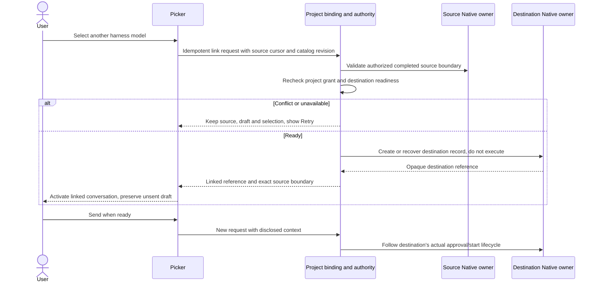

# Harness adapter contract

This is a target integration contract, not a shipped Vivary API. It composes the installed Native harness API and preserves the existing Code and Native thread owners. The current two-engine Code path does not yet implement this catalog or generic native resume. [M03, M04 and M05](modules.md) own the change boundaries.

## User flow first

A person opens the composer picker, sees Claude Code, Codex and other supported registered harness groups with small recognizable marks, and chooses a model reported by that harness on the selected host. The active choice reads as harness plus model. The selected supported installed harness owns its tools, MCP configuration, models and native permission semantics. Vivary discovers and displays only what it actually observes. Unknown availability stays unknown, and Vivary does not add a second general tool picker.

Supported registered entries can show an unavailable/setup state. Selection is enabled only when the requested mode is supported and authorized. An installed unknown CLI is not automatically executed or labeled supported. Discovery runs bounded probes for known registrations. Refresh rechecks the catalog after installation, login or version changes. Vivary retains project and host authorization plus approval, denial and Stop for the exact request.

A same-harness model change stays in the conversation only when the adapter confirms compatibility. A different harness creates a linked conversation in the same project. No handoff wizard is required. The existing unsent text remains unsent. Source history is accessible through its original owner. Preparing a handoff is a separate action.

## Existing API versus Vivary composition

Source basis: installed `@agent-native/core` 0.176.5, especially `docs/content/harness-agents.mdx`, the public `@agent-native/core/agent/harness` exports, and the current source entries below. Read that version's declarations before writing an implementation. Names in the conceptual sketch are proposals unless explicitly listed as existing exports.

| Existing owner | What it already supplies | Vivary composition required |
| --- | --- | --- |
| Native harness registry | Registration, lookup, built-ins and package presence | Project/host-scoped catalog with readiness and model observations |
| Native `AgentHarnessAdapter` | Identity, capabilities and `createSession` | Binding to project, root, host and current policy |
| Selected supported installed harness | Tools, MCP configuration, models and native permission semantics | Truthful display of observed availability without a second general tool picker |
| Native session | `streamTurn` and supported optional continuation, approval, detach, stop and destruction | Capability-specific UI and truthful recovery |
| Native harness lifecycle | `startAgentHarnessRun`, follow-up/approval/stop and SQL harness session state | Dispatch through the selected owner without duplicating run storage |
| Native events | Text, activity, thinking, tools, approval, file change, compaction, usage, error and done | Scoped projection and evidence/unknown states |
| Existing Native Code path | Code run records, executor, transcript and controls | Preserve prior Code history and declare compatibility replay until an accepted migration |
| Existing Native chat | Native thread records and chat behavior | Present authorized legacy threads in the same shell without pretending they are CLI harness sessions |

Current code: [local-code-agent.ts](../../../../packages/workbench/server/local-code-agent.ts), [local-runtime-setup.ts](../../../../packages/workbench/server/local-runtime-setup.ts), [project-runtime-readiness.mjs](../../../../packages/workbench/server/project-runtime-readiness.mjs), [project-services.mjs](../../../../packages/workbench/server/project-services.mjs), and the [Code execution host](../../../../packages/workbench/server/code-execution-host.ts).

The current Code follow-up reconstructs a bounded prompt. That is replay, not opaque native-session resume. Existing state must remain readable during migration. Never feed Claude resume state to Codex or infer a new session's authority from linked history.

Vivary supplies its original engine and narrow deterministic workspace operations. When a user capability is missing, explain whether the boundary is the harness, the observed host state, project or host authorization, or an existing Vivary operation before proposing another tool.

## Conceptual boundary sketch

```text
CatalogRequest
  host reference, project reference, expected binding/policy revisions
CatalogObservation
  observation revision and time
  adapter identity, label, trusted icon key, installed runtime version
  registered/configured/installed/authenticated/authorized/bound/runnable/verified
  models, tools, MCP configuration and native permissions: observed state OR unknown
  capabilities: supported / unsupported / unknown per capability

ConversationReference
  project reference + owner kind + opaque Native record reference
RuntimeBinding metadata beside that reference
  stable adapter ID + Vivary compatibility contract revision
  observed runtime/protocol version where available + capability snapshot
  host and execution/storage location + project/root/binding/policy revisions
  verification evidence scoped to capability, version, mode and observation time
Owner kind
  native-thread | native-code | native-harness

LinkRequest
  operation ID + source ConversationReference
  source completed-event cursor and version
  destination adapter/model identity + expected catalog revision
  expected project/binding/policy revisions
LinkResult
  existing-or-created destination reference + source boundary reference
  OR conflict / unavailable / denied / failed / uncertain

OperationResult
  stable code + operation ID + retryability
  safe current revision where needed for recovery
  actual Native run/session/result reference when established
```

This is a contract sketch, not an instruction to create these exact tables or duplicate framework types. Conversation operations are facades over Native owners. Use a suitable existing metadata/relation owner for links. Only add missing product metadata after confirming the framework lacks an appropriate place. Plans and approvals also remain references to their authoritative owners.

## Adapter capability matrix

| Capability | Requirement | If absent or unknown |
| --- | --- | --- |
| Registered identity and compatible version | Required before selection | Show unavailable. Never launch arbitrary executable |
| Model enumeration | Report actual supported observation and origin | Show list unavailable and supported setup path. Do not invent models |
| Text turn and understood completion/error events | Required for interactive execution | Adapter remains unsupported |
| Project/root binding | Required for project-scoped work | Refuse execution |
| Cancellation and process outcome observation | Required for an enabled execution mode | Refuse modes where safe Stop cannot be provided |
| Native tool and permission semantics | Owned by the selected harness and observed when exposed | Preserve unknown. Do not invent a second permission or tool catalog |
| Vivary host/project authorization and exact approval, denial and Stop | Required for execution | That mode is unavailable. No prompt-only substitute |
| Native resume | Optional, explicitly advertised and proven | New linked conversation or labeled replay where accepted |
| Structured tool and file events | Capability-specific | Display available evidence. Do not claim unseen tools or changes |
| Usage/cost reporting | Optional unless the selected policy requires it | Show unknown. Do not infer zero or verified spending control |
| Context limits/compaction visibility | Adapter-specific observation | Label unknown and avoid promising full model context |
| Sandboxed root enforcement | Required for a mode that promises isolation | Local mode must accurately describe its authority or remain unavailable |
| Detach/background execution | Required for continuation after client closure | Do not advertise background persistence for that mode |

ACP can be an adapter route when the runtime supports it, but protocol presence is not universal feature parity. In the inspected Native docs, ACP resume depends on advertised load-session support. Prove the actual chosen agent/version. Native's inspected adapter interface has no generic protocol-version field. Any Vivary compatibility revision is product metadata, not a claimed framework field.

## Linked-conversation sequence



Link creation and destination-session initialization must follow the selected Native owner. If a CLI creates its native session only on first turn, retain a destination conversation reference until then. Do not launch model work merely to manufacture an ID. Retried linking recovers the same destination. A changed source cursor yields an explicit conflict rather than a different undocumented history boundary.

## Three separate continuity concepts

1. Recorded history: exact events retained by the source owner and readable through authorization at a declared boundary.
2. Supplied model context: the bounded material actually passed on this turn, including explicit selected/scoped sources and labeled summaries or omissions.
3. Native resume: continuation using the original harness's opaque session state through its supported lifecycle.

Linking provides the first. It cannot promise the second contains every event, and it does not transfer the third. A linked source revoked later remains an unavailable reference. Previously supplied material may already exist in destination history. Revocation is not a claim that a model or provider forgot it.

## New or upgraded harness acceptance

1. Implement a supported Native adapter or protocol integration and its bounded model/readiness probe. Reuse framework lifecycle and secret resolution.
2. Confirm package/executable identity, version, configuration and account state without logging raw credentials.
3. Prove start, text, error, cancellation and denied-request behavior with deterministic fixtures. Prove optional capabilities only when advertised.
4. Prove one authorized real start, tool result, Stop and continuation on the intended host. Keep model budgets and external actions explicit.
5. Exercise absent package, expired login, unknown model, stale binding, removed runtime, corrupt resume state, malformed event, timeout and restart.
6. Confirm a new adapter appears through catalog data, without adding an engine-name branch to the workspace UI or changing transcript ownership.
7. Before resume, re-resolve the same adapter and compare the stored compatibility snapshot with current required capabilities and authority. Never substitute a different adapter. A compatible model change records its transition without retargeting an active turn.
8. Keep an old active session bound to its observed runtime. Upgrade at an idle boundary and preserve old history. An incompatible update offers recovery rather than silent substitution.

Stop is an ownership-checked control operation. It must remain available for an already running owned process when model discovery fails or its folder disappears. Rechecking launch readiness must not prevent emergency cancellation.
