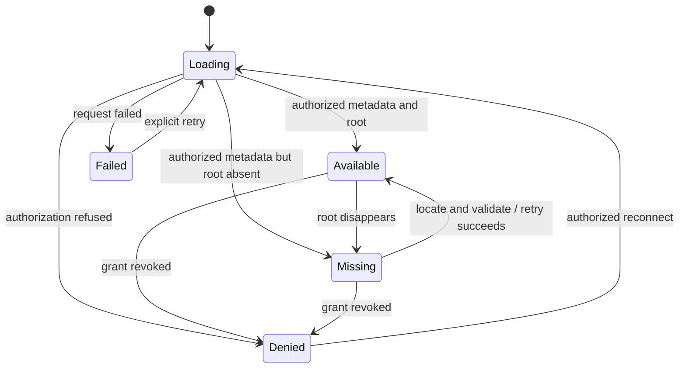
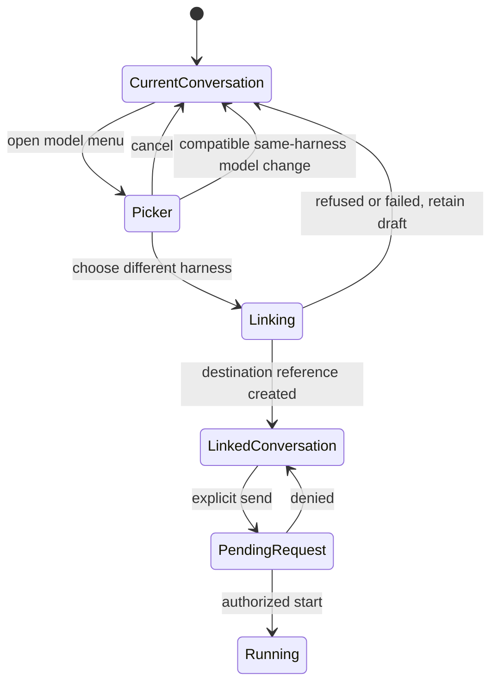
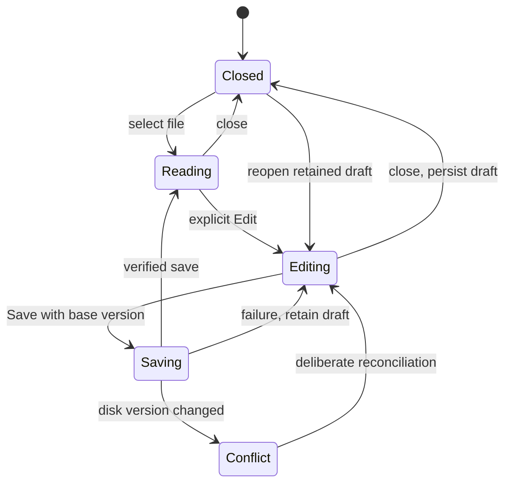
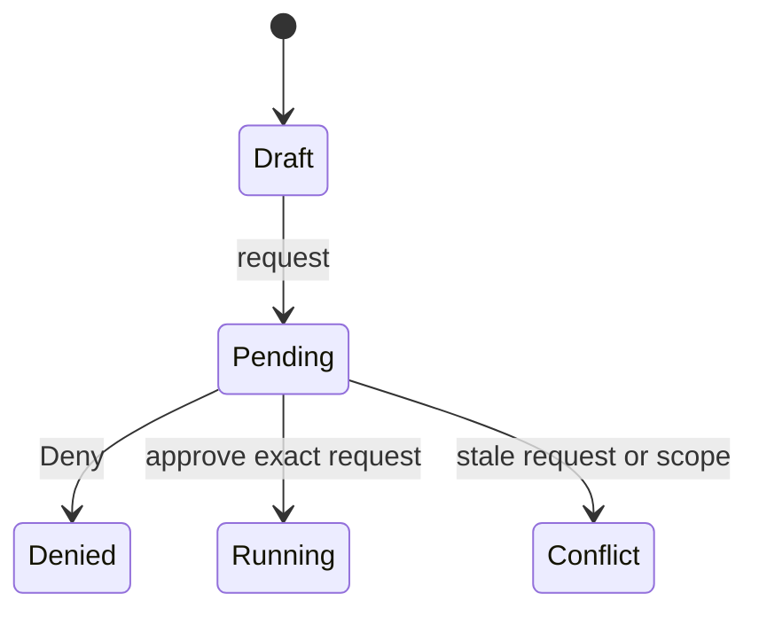
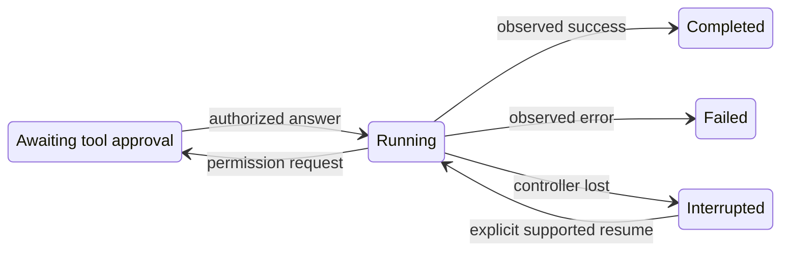
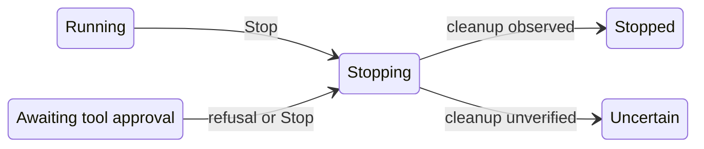
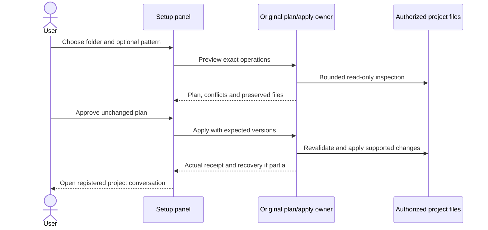
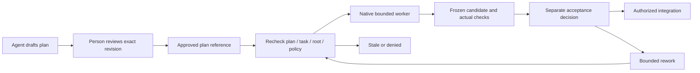
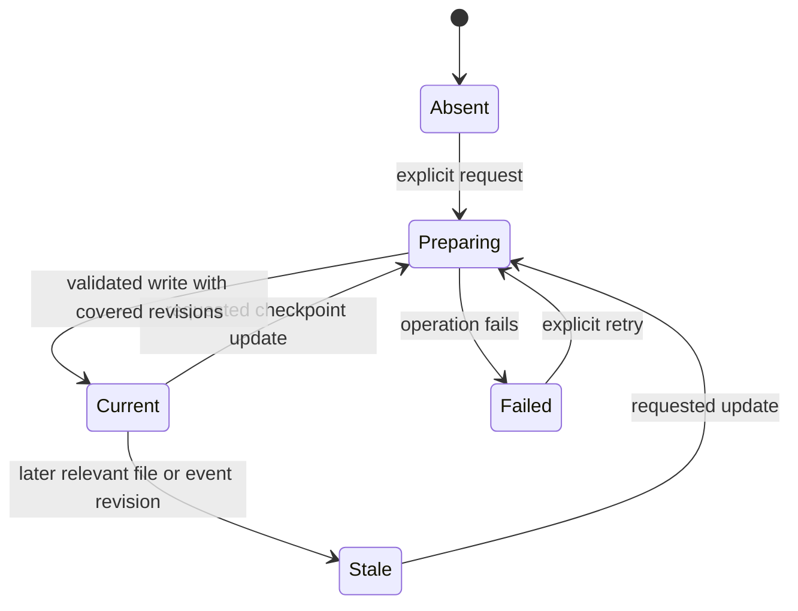
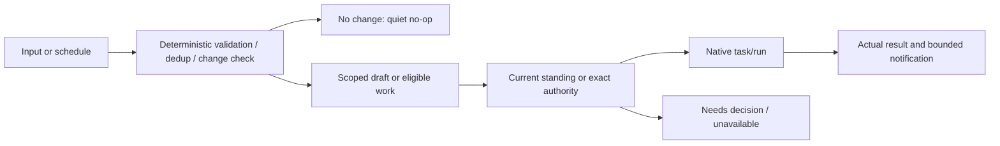

# Journeys and state diagrams

These are design acceptance scenarios. Existing component proofs do not establish that the complete journey works. [Action IDs](actions.md) identify the controls and operations. The [workspace interaction contract](../unified-workspace.md) owns the selected layout direction.

## J01: Enter and arrange the workspace

On a wide display, a project/conversation navigation rail sits beside the active conversation. A compact project context inspector can supply orientation. Exact initial inspector visibility and widths remain proposed design choices. Files open only on request. The composer, current project/runtime, activity and Stop are always recoverable without navigating to another application mode.

```text
+------------------+--------------------------------+-----------------------+
| Projects         | Project / conversation         | Requested inspector   |
|   Conversations  | Host / harness / model         | or file / plan        |
|                  |                                |                       |
|                  | Conversation and tool results  | Close / expand        |
|                  |                                |                       |
|                  | Approval or active work        |                       |
| Close navigation | Composer and one model picker  |                       |
+------------------+--------------------------------+-----------------------+
```

The diagram shows available regions, not mandatory open columns. Close each side independently. Reopening restores that client's prior selection and safe width. A document can expand for focused work, then return beside the conversation. Phone preferences must not overwrite desktop widths. At 390 px, navigation and work panels start closed and open as focused views with a clear return to the conversation.

Acceptance: keyboard and pointer resize, close/reopen, maximize/restore, theme, 200% zoom, loading/empty/error states and long labels. Opening a panel must not remount an active chat, interrupt its stream, change project, approve work or lose a draft. Relevant actions: A001-A009 and M06.

## J02: Select a project and recover its root



Missing and denied are distinct. Missing keeps authorized history and drafts readable with file-dependent execution disabled. Denied must protect history and files. The metadata/history read path must not require live folder resolution, but must still recheck current project authorization. Never silently select a different project. An active owned run keeps a Stop path even if its root disappears.

Acceptance: two projects with different drafts and conversations. Fail selection/refresh. Move/remove one folder. Revoke access. Retry. Reopen the previous authorized history. Registration never creates instructions or adopts the folder. M02, M03 and M05 own this path.

## J03: Choose a model or another harness

The implemented two-engine picker selects Claude Code or Codex for a new conversation. Codex resumes its own native session on follow-up. Runtime/model changes require a new conversation. The grouped picker and linked-history sequence below are target behavior, not the shipped switching flow. [Implemented Codex behavior](harness-adapters.md#implemented-codex-behavior) defines immediate Send, native approvals, modes, and activity cards.

The single picker groups model rows under Claude Code, Codex and other supported registered harness names. Each group has a small trusted logo or generic fallback. Unknown brands cannot inject markup. Readiness appears beside unavailable entries. No preset persona is required. Optional user-authored profiles use the existing Native resource/settings owner or intentionally authored project instructions. A person can create/edit, select, clear and inspect their effective instruction sources. Selection applies to future explicitly requested context and records the profile revision. Clearing preserves history and does not claim prior model context was erased. Profiles cannot grant tool permissions or transfer approval.



The detailed [adapter sequence](harness-adapters.md#linked-conversation-sequence) binds the source completed-event cursor and catalog revision. Linking does not run a model. Preserve unsent input, source history and source pending work. Any active request remains with its originating conversation. A second conflicting writer is not implicitly authorized by switching harnesses.

Acceptance includes unavailable models, expired login, removed adapter, duplicate link retry, failed initialization, incompatible resume and a source that gains new events while the picker is open. Show recorded history separately from what the destination model actually receives.

## J04: Read and edit a document beside the conversation



Read formatted Markdown first. Source editing is explicit. Preserve source whitespace and newline behavior. Saving or renaming revalidates current root, grant, path and version. A conflict shows disk and draft without silently overwriting either. Closing the file or switching projects retains its scoped draft. Rename retains current same-folder semantics until a separate move contract is implemented. The current operation is not an atomic filesystem rename promise.

Acceptance includes long text, unsupported/binary/oversized content, private paths, traversal, symlink/root changes, external edit, deletion, spaced names, CRLF, failed persistence, close/reopen and restart. A file read does not auto-stage context to the agent.

## J05: Approve, deny, stop and reopen work

### Request authorization



### Execution and recovery



### Cancellation



This is a user-visible normalized state model, not a replacement Native lifecycle table. Map existing owner states without fabricating transitions. Approval shows the request, project, harness and effect scope. Denial starts nothing. Each follow-up follows its actual approval policy. Runtime completion and workflow acceptance remain separate. A terminal denied outcome belongs in its conversation rather than a permanent banner over unrelated work.

Closing a browser does not cancel already approved background work when the selected mode supports it. Reopening shows the actual state and result. Closing panels never removes the activity/Stop path. A host restart must not reinterpret pending work as approved or blindly replay a possibly completed operation.

## J06: Create or adopt a workspace



Skip VCS, repository host, template and Brain independently. Adoption preserves existing instructions/tooling and makes conflicts visible. A built-in pattern is editable workspace content, not a mandatory agent personality. External templates remain held until their separate prerequisites and owner decision pass. Test empty/populated/no-VCS folders, changed files after preview, duplicate submit and partial application.

## J07: Plan, execute and review

Plans can be authored in a document or supported plan view. The selected task source owns tasks and lifecycle. Approve an exact plan revision with its intended effects and verification. A worker uses Native lifecycle and the current project/runtime binding. The board projects source state.



Moving a card to Done cannot establish acceptance. A changed target or candidate invalidates the corresponding integration approval. No-VCS work uses versioned files and conflict-aware changes. Git/Jujutsu/host integration uses supported adapters and distinct authority. Full board/factory orchestration remains later scope.

## J08: Prepare and maintain a handoff

A handoff action asks the current agent to reconcile goal, decisions, changes, actual checks, unfinished work, risks and next action. Deterministic tools gather current file/VCS/run facts and validate versions. The agent interprets them and writes the designated existing document through the file owner.



Failure retains a previous readable version. Stale detection is deterministic and costs no model call. Updating narrative is agent work under authorization. Preparing a handoff never auto-cleans, commits, merges, deletes or declares dirty work clean. Cross-harness switching does not require this workflow.

## J09: Search, memory and learning

Exact file and chat search return source references. Open a match in a requested panel, revalidating the current source. Save a selected sourced fact to project memory. Reopen/restart and retrieve within that project, then correct or remove it from active memory. Index refresh follows source change. Forgetting active memory does not promise erasure from past transcripts, backups or providers.

Optional Brain and semantic retrieval have skip, unavailable and rebuild paths. Learning is a separate proposal/evaluation/review/change loop. It cannot promote private project knowledge or rewrite authority without explicit scope. Writing and creative artifacts use these same file/conversation contracts. No separate media-generation service is assumed.

## J10: Intake, research and scheduled workflows

Research is agent work with sources and uncertainty, optionally delegated through Native tasks. Signed intake verifies sender, signature and project route before producing a draft. Duplicate input does not duplicate a task. Outbound sending requires exact recipient/content authority.



Factory and heartbeat use existing Native scheduling/task owners. Preserve one task identity, bounded retries and no-progress stops. A periodic trigger is not new authority. These later features remain unavailable until their integration and activation gates pass.

## J11: Host, preview and platform acceptance

The live preview is isolated from privileged app state. Supported agent browser tools inspect its errors through the same project conversation. Remote access explicitly connects an authenticated browser to the chosen host and can be revoked. Reconnection restores authorized references rather than starting another run.

Hosted application checks must exercise the actual updated build before it is offered for review. Windows checks then launch the exact packaged artifact on real local folders, with bundled runtimes and no global Node/Python dependency. Test restart, approvals, drafts, local dialogs, preview and process cleanup. A portable folder assembled on Linux is not Windows acceptance.

## J12: Publication and retained scope

Installed help, artifact licenses and version evidence follow implemented behavior. Public website, OpenAPI, MCP, A2A, WebMCP, authentication metadata, DNS/discovery and scanner acceptance remain later publication work. Each transport projects real scoped actions. Preparing configuration does not create accounts, DNS or endpoints. Public release and legacy retirement require their exact authorization and evidence.
