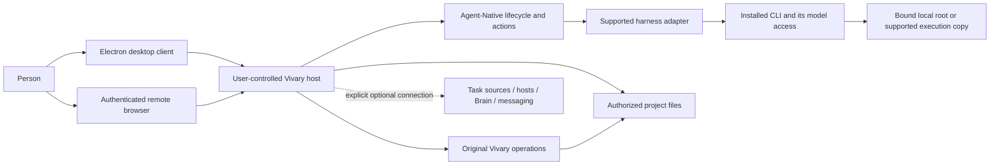
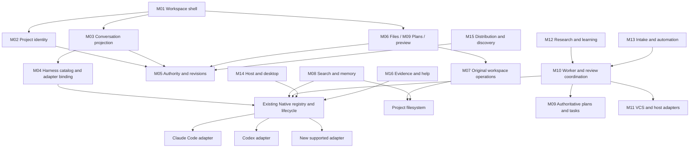
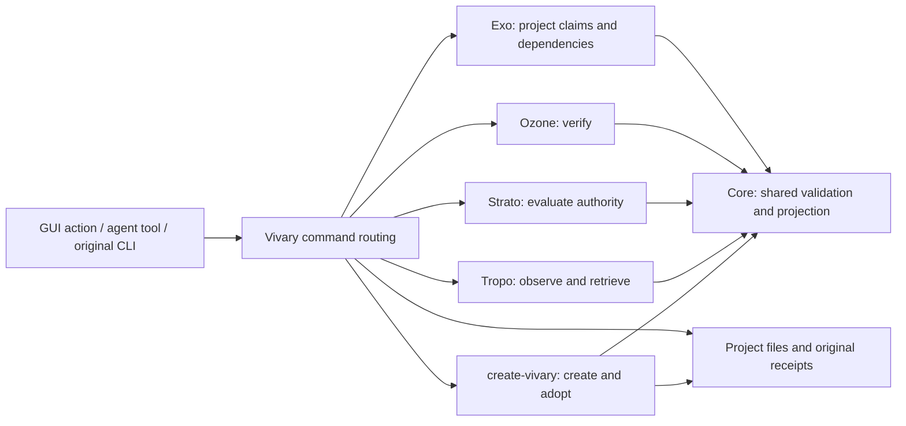
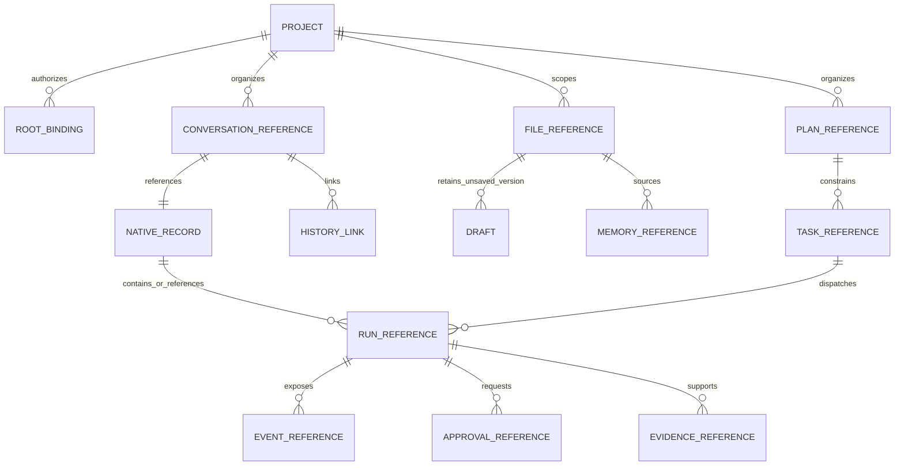
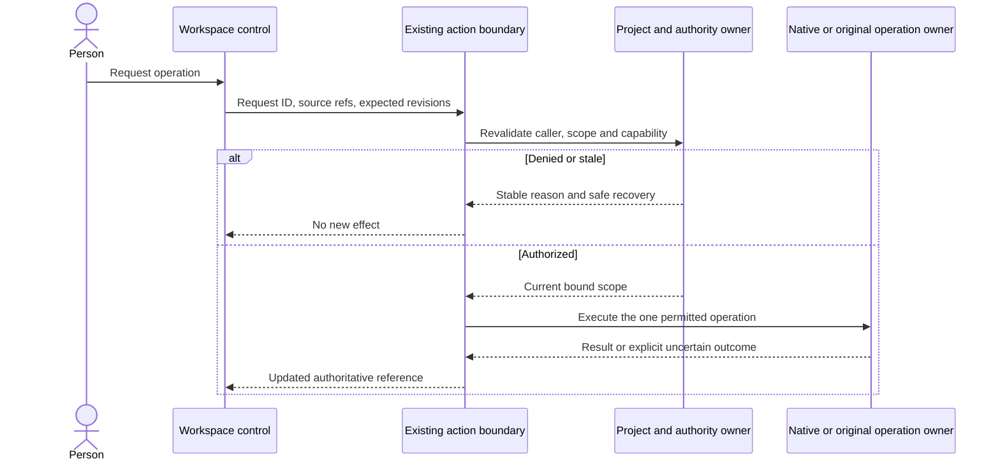

# System and data diagrams

These diagrams describe target responsibilities. A box is a logical module, not a request for a new package, service or database. [Modules](modules.md) names current code and planned composition. [Actions](actions.md) defines observable operations.

## Context

The host owns authoritative Vivary state and coordinates execution. Each session records its actual execution and storage locations, including any supported sandbox or execution copy. A browser on a phone controls that host. It does not mount the phone's or laptop's folders. Desktop use defaults to loopback and no Vivary signup. Remote access is explicitly authenticated and revocable. A model provider can still receive supplied model context according to the selected harness and account. Local storage is not a claim of offline model inference.

## Stable core and replaceable edges

The stable contract covers identity, authorization, revisions, effect outcomes and source references. Replacement code can change how a supported external system is reached. It cannot redefine another module's IDs, claim a grant or mutate a transcript behind its owner.

## Original Vivary module composition

The original command owner determines each verb's semantics. The adapter translates inputs and results. It does not reimplement create, adopt, doctor, capabilities, find, check, decide, review, impact or control. App-invoked receipts belong in private app data where the packaging contract requires them. Standalone CLI behavior remains usable without the GUI.

## Data ownership

This is a conceptual relationship diagram, not a proposed SQL schema. NATIVE_RECORD denotes one of the existing Native thread, Code run or harness-session owners. Their schemas and lifecycle are distinct. A history link stores a source reference and completed-event boundary. It never copies the transcript or transfers opaque resume state. A file reference is not a replacement for its actual filesystem bytes.

| Information | Authoritative owner | Stored elsewhere only as |
| --- | --- | --- |
| Project identity and root grants | Existing registry/binding services | Stable ID and current revision |
| Conversation content and run events | Appropriate Native thread, Code or harness owner | Authorized projection or source reference |
| Resume state | Originating Native harness/session owner | Opaque reference, never cross-harness state |
| Project document bytes | Authorized project filesystem | Draft with base version or rebuildable index |
| Unsaved document/composer draft | Existing scoped app-state/draft owner | Client projection with persistence failure visible |
| Panel width and open state | Safe client-specific preferences | Presentation only, not shared execution state |
| Task lifecycle | User-selected task source | External ID, version and display projection |
| Plan and approved revision | Selected Native/local plan owner | Exact revision reference |
| Credentials | Existing scoped secrets or harness login | Readiness observation, never raw secret |
| Knowledge | Sourced project files or explicitly selected Brain | Retrieval result with provenance |
| Usage/cost | Observed Native/harness event data | Labeled report. Absent data stays unknown |

## Effect boundary

A preflight result is not permanent permission. Revalidate immediately before effects. A timeout after a possible effect is uncertain until reconciled. Do not retry by creating a second run, file operation or external publication. Display refresh reads the owner. It does not replay the action.
