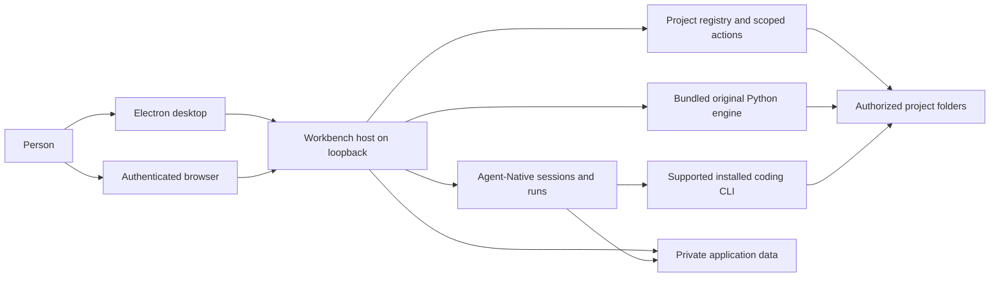
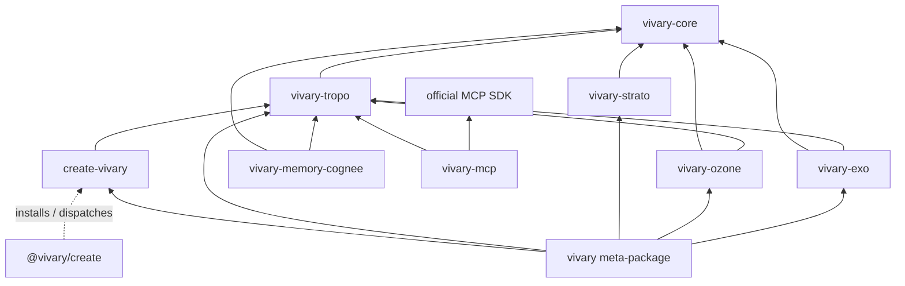

This is the high-level design for the desktop and self-hosted product in `vivary-dev/Vivary-New`. It describes the system that contributors change and the boundaries they must preserve. The [module catalog](https://github.com/vivary-dev/Vivary-New/blob/dev/docs/product/multi-project/specification/modules.md) owns detailed responsibilities and source entry points. The [desktop acceptance register](https://github.com/vivary-dev/Vivary-New/blob/dev/docs/product/multi-project/desktop-acceptance-status.md) owns proof by candidate. GitHub issues own task scope and lifecycle.

## Purpose and owner intent

Jeff's [desktop release decision](https://github.com/vivary-dev/Vivary-New/blob/dev/docs/product/multi-project/desktop-release.md) calls for one Vivary instance on a user-controlled computer or suitable server. A local desktop window and a responsive browser connect to that host. The host keeps agents, project files, credentials, history, and memory. Local desktop use needs no Vivary account. Remote browser access requires explicit setup and authentication. Zo hosts development and a private preview. It is not a required user service.

The [unified workspace decision](https://github.com/vivary-dev/Vivary-New/blob/dev/docs/product/multi-project/design.md#unified-workspace-decision-2026-09-14) puts one selected project conversation at the center. A project can have several independent conversations. Files, details, search, and preview open as optional panels. Supported installed coding runtimes retain their own tools, models, permissions, and sessions. Vivary binds their work to the selected project. A cross-runtime link and a maintained handoff remain separate product capabilities, not an implicit transfer of a live run. The [interaction contract](https://github.com/vivary-dev/Vivary-New/blob/dev/docs/product/multi-project/unified-workspace.md) owns those details.

The original Vivary engine remains available as standalone commands and through bounded application operations. A project keeps its own folder and conventions. The original five-file workspace contract, plain authored files, and optional version control let a user continue work without the GUI. The [original CLI reference](/original-cli/) owns command and release status.

The original design reduces active agent context. `AGENTS.md` routes to `.vivary/context.md`, and `STATE.md` is read when state matters. Typed records arise from actual work. Core keeps evidence, provenance, receipts, and authority explicit. Optional semantic retrieval can suggest candidates, but it does not become authored truth. [Original CLI architecture](#original-engine) explains the package boundaries.

## Success criteria

The [desktop release journey](https://github.com/vivary-dev/Vivary-New/blob/dev/docs/product/multi-project/desktop-release.md#acceptance-journey) defines observable success. A person can install and open the Windows package without a source checkout or Vivary account, create and adopt projects, and run authorized work in each. They can inspect actual tool results, stop work, close the app, and reopen the same project and conversation. They can save a project fact, retrieve it in a fresh session, correct it, and remove it from active memory. They can find an older chat by message content and search project files by filename, exact text, and regex. They can use all ten original command verbs through the installed operations. A desktop and phone browser can connect to the same authenticated private host, and a project preview can support an observed error and authorized repair.

These are release criteria, not a claim that the full journey passes. The [acceptance register](https://github.com/vivary-dev/Vivary-New/blob/dev/docs/product/multi-project/desktop-acceptance-status.md#capability-and-acceptance-gaps) names the tested source and platform for each accepted slice and the remaining gaps. Hosted, simulated-provider, and packaged Windows evidence have different limits.

## System structure

The Electron process starts a local Workbench server, opens its loopback origin, and manages shutdown. The browser client presents the same host state. The Workbench launcher chooses local, hosted, or private-proxy access and locates private data. The source owners are [`packages/desktop/main.mjs`](https://github.com/vivary-dev/Vivary-New/blob/dev/packages/desktop/main.mjs), [`packages/workbench/bin/start.mjs`](https://github.com/vivary-dev/Vivary-New/blob/dev/packages/workbench/bin/start.mjs), and [`server/local-access.ts`](https://github.com/vivary-dev/Vivary-New/blob/dev/packages/workbench/server/local-access.ts). The browser does not run agents or mount a phone's files.

Workbench composes Agent-Native's application, chat, run, action, and storage owners. Native keeps transcripts and run lifecycle. Workbench keeps project identity and authorized root bindings, then resolves those bindings for actions and sends. The registry uses Native's database with Workbench project, binding, revision, receipt, and mutation tables. See the [project registry](https://github.com/vivary-dev/Vivary-New/blob/dev/docs/product/multi-project/source-map/modules/project-registry/index.md), [`project-services.mjs`](https://github.com/vivary-dev/Vivary-New/blob/dev/packages/workbench/server/project-services.mjs), and [`db/schema.mjs`](https://github.com/vivary-dev/Vivary-New/blob/dev/packages/workbench/server/db/schema.mjs). An observed path is not by itself a project identity or a write grant.

The selected coding runtime owns execution, tools, model access, and native session continuity. Workbench currently supports Claude Code and Codex through Native Code records and the local Code host. Codex uses its app-server and account-effective model catalog. Workbench relays native approvals, progress, child activity, and Stop. Native provider chat uses Native's chat owner with a project send guard. The [harness adapter contract](https://github.com/vivary-dev/Vivary-New/blob/dev/docs/product/multi-project/specification/harness-adapters.md), [Native owner map](https://github.com/vivary-dev/Vivary-New/blob/dev/docs/product/multi-project/native-owners.md), and [runtime source map](https://github.com/vivary-dev/Vivary-New/blob/dev/docs/product/multi-project/source-map/modules/native-runtime/index.md) describe the distinct owners.

### Original engine

The original engine remains a package family, not another agent loop. `vivary-core` owns pure validation and projection while callers retain execution, persistence, and human approval. Tropo observes, builds typed graph context, and retrieves. Strato evaluates policy. Ozone verifies evidence and proposes gated repairs. Exo projects claims, dependencies, and handoffs. `create-vivary` creates and adopts workspaces. The optional MCP and semantic-memory adapters are outside the default package path. The `vivary` front door routes ten verbs to their package owners. The Workbench bundles this Python runtime and calls its established commands rather than reimplementing their decisions. See [the command reference](/commands/) and [package manifests](https://github.com/vivary-dev/Vivary-New/tree/dev/packages).

### The shared seam: vivary-core

Core is a library shared by Tropo, Strato, Ozone, and Exo. It owns deterministic
evidence projection, bounded task capsules, receipt validation, policy decisions,
and control-state projection. Callers retain clocks, execution, state persistence,
and human approval. Unknown, conflicting, or omitted evidence stays visible.
Observed ambiguity does not become permission to act. The [Core contract](https://github.com/vivary-dev/Vivary-New/blob/dev/packages/core/README.md)
owns the detailed schemas and refusal rules.

### Package dependency map

This map shows direct source-manifest dependencies; omitted arrows are deliberately
absent. In particular, the `vivary` meta-package receives Core transitively, while MCP
and memory remain optional and outside that meta-package.

The [package manifests](https://github.com/vivary-dev/Vivary-New/tree/dev/packages) own dependency version floors. Each
shipping package declares the Core dependency it imports. The meta-package
receives Core through its component dependencies. Source versions and published
versions remain distinct in the [CLI release status](/original-cli/#release-status).

### Distribution names

The package names remain part of the original engine's architecture. The
[original CLI release status](/original-cli/#release-status) owns published
versions. A changed source version is not evidence of a registry release.

- npm: `@vivary/create` launches the workspace creator.
- PyPI: `vivary`, `vivary-core`, `vivary-tropo`, `vivary-strato`, `vivary-ozone`,
  `vivary-exo`, `create-vivary`, `vivary-memory-cognee`, and `vivary-mcp`.

The optional memory and MCP distributions remain outside the default path.
Coordinated releases publish Core before its dependent role packages.

## Runtime flows

1. **Select a project.** Workbench resolves the authenticated actor, stable project ID, current binding, policy revision, and observed root. Project selection changes the files and history shown. A missing folder leaves authorized history available but blocks file-dependent execution. [Project registry](https://github.com/vivary-dev/Vivary-New/blob/dev/docs/product/multi-project/source-map/modules/project-registry/index.md) owns the identity contract.
2. **Send and continue.** A Native chat send rechecks its pinned project scope before model or attachment work. A Code send starts or resumes the selected native session against its bound project. Native stores the resulting run and transcript. A model choice or project switch cannot silently move an active run. [`native-chat-project.ts`](https://github.com/vivary-dev/Vivary-New/blob/dev/packages/workbench/server/native-chat-project.ts), [`local-code-agent.ts`](https://github.com/vivary-dev/Vivary-New/blob/dev/packages/workbench/server/local-code-agent.ts), and the [session model](https://github.com/vivary-dev/Vivary-New/blob/dev/docs/product/multi-project/desktop-release.md#one-understandable-model) own this flow.
3. **Approve, deny, or stop.** Native owns an action request and its execution lifecycle. Workbench checks the owner, project, run, and exact request before relaying a decision. Stop targets the owned running work. Client closure does not itself approve or replay an action. The [coding permission decision](https://github.com/vivary-dev/Vivary-New/blob/dev/docs/product/multi-project/design.md#native-coding-permissions-and-activity-2026-09-16) and [authority module](https://github.com/vivary-dev/Vivary-New/blob/dev/docs/product/multi-project/specification/modules.md#m05-authority-and-approvals) own the rules.
4. **Read and change project files.** Scoped file actions list and read bounded content. Explicit Save and Rename check the selected project and file revision. The Search panel walks one authorized project with caps, private-file exclusions, and continuation. It does not use a persistent index or a shell search process. [`project-files.ts`](https://github.com/vivary-dev/Vivary-New/blob/dev/packages/workbench/server/project-files.ts), [`project-search.ts`](https://github.com/vivary-dev/Vivary-New/blob/dev/packages/workbench/server/project-search.ts), and the [write-back map](https://github.com/vivary-dev/Vivary-New/blob/dev/docs/product/multi-project/source-map/modules/project-writeback/index.md) own the behavior and limits.
5. **Call the original engine.** The bundled Python runtime receives a bounded command and a selected project root. The five project read reports share one server module for the Details panel and the Native tool. The agent tool gets its project from the chat's pinned scope, not model-supplied input. Public Doctor, Find, and Check use the privacy-filtered CLI path. Governed writes retain their own plan, authority, and receipt rules. [`original-runtime.ts`](https://github.com/vivary-dev/Vivary-New/blob/dev/packages/workbench/server/original-runtime.ts), [`project-read.ts`](https://github.com/vivary-dev/Vivary-New/blob/dev/packages/workbench/server/project-read.ts), and the [issue #19 receipt](https://github.com/vivary-dev/Vivary-New/blob/dev/docs/product/multi-project/receipts/09b-original-read-tools.md) record the delivered slice.
6. **Preview a project.** A reviewed local command starts a project process. The app presents its page in an isolated frame and supports Stop. The selected coding runtime can inspect and repair the project through its supported browser tools. The [preview receipt](https://github.com/vivary-dev/Vivary-New/blob/dev/docs/product/multi-project/receipts/11e-live-project-preview.md) states what passed on Zo and what still needs packaged or platform proof.

## Data and trust boundaries

| Data or effect | Owner and boundary |
| --- | --- |
| Project files and authored memory | Stay in the user's authorized folder. Workspace roles identify authored knowledge. `.vivary/memory/` is disposable semantic-provider state, not an authored note store. |
| Project identities and bindings | Workbench registry tables in private Native-backed application data. The server checks actor, collection, device, policy, and observed root before effects. |
| Conversations, runs, and approvals | Native records in private application data. Workbench stores references and project scope rather than copying full transcripts into a second store. |
| CLI credentials and logs | Stay in each provider's supported location. Vivary references native sessions. App-invoked original command receipts go to private application data. |
| Search results and indexes | Project file search reads the authorized folder with bounded work. A future derived index is rebuildable and belongs in private application data. |
| Preview processes | Start only from reviewed project commands. Preview content is isolated from privileged Workbench state. Stop and host shutdown own cleanup. |

The local desktop server binds to loopback and opens without a Vivary login. Hosted mode uses Native authentication. The private Zo preview uses its owner-login proxy boundary. Remote access to a user's host remains an explicit, authenticated setup requirement, with real-phone and revocation acceptance still open. [`local-access.ts`](https://github.com/vivary-dev/Vivary-New/blob/dev/packages/workbench/server/local-access.ts) owns request checks. The [host decision](https://github.com/vivary-dev/Vivary-New/blob/dev/docs/product/multi-project/design.md#host-and-browser-access-decision-2026-09-13) owns the product boundary.

The Electron window accepts its local server origin, isolates the renderer, denies browser permissions and downloads, and routes a small set of setup links externally. A project grant does not bypass CLI-native permissions. A prompt containing a path is not filesystem isolation. The selected harness may send supplied model context to its provider. Local storage does not imply offline model inference. The [runtime isolation decision](https://github.com/vivary-dev/Vivary-New/blob/dev/docs/product/multi-project/design.md#runtime-ownership-and-isolation) and [desktop host](https://github.com/vivary-dev/Vivary-New/blob/dev/packages/desktop/main.mjs) own those limits.

## Delivery and known gaps

The unified workspace, project registration and selection, scoped Code and Native history, bounded files and search, reviewed project preview, bundled original CLI, and selected original operations have implemented and tested slices. The [acceptance register](https://github.com/vivary-dev/Vivary-New/blob/dev/docs/product/multi-project/desktop-acceptance-status.md) states their candidate-specific evidence. A passing component or source check does not complete the desktop and browser release journey.

Issue #19's five project read reports entered `dev` in PR #89. Its receipt records hosted fake-provider proof and earlier Windows packages. The final `e6ccddf5` Windows package's panel reads and agent turn were still pending in that receipt. Treat that acceptance as pending until the owning issue and register record the later result. PR #90 added [route-question research](https://github.com/vivary-dev/Vivary-New/blob/dev/docs/product/multi-project/research/tropo-find-route-questions.md) only. It did not change Tropo's public path refusal or MCP privacy rules.

Scoped memory through real agent runs, chat-content search, a generic grouped harness catalog, linked cross-harness conversations, concurrent root runs, and complete GUI/agent coverage of all original operations remain open. Real Native-provider turns belong to issue #50. Deterministic-provider checks do not prove them. Automation execution depends on that separate work. Authenticated phone routing, revocation and reconnect, packaged preview behavior, upgrade and removal, and final Windows acceptance remain release work. The [release target](https://github.com/vivary-dev/Vivary-New/blob/dev/docs/product/multi-project/desktop-release.md), [module catalog](https://github.com/vivary-dev/Vivary-New/blob/dev/docs/product/multi-project/specification/modules.md), and live issues own the precise current status.

## Maintaining this document

This page owns the full-product structure, data owners, trust boundaries, and cross-component flows. Detailed contracts and source paths live in the [module catalog](https://github.com/vivary-dev/Vivary-New/blob/dev/docs/product/multi-project/specification/modules.md) and [source map](https://github.com/vivary-dev/Vivary-New/blob/dev/docs/product/multi-project/source-map/index.md). Product decisions live in [design.md](https://github.com/vivary-dev/Vivary-New/blob/dev/docs/product/multi-project/design.md). GitHub issues own goals, acceptance, dependencies, and lifecycle. Update those owners with this page when their facts change.

For a relevant source, configuration, or documentation change, update this page in the same commit. When the change alters architecture, revise the affected description, diagram, flow, boundary, or gap. When an internal change leaves the described architecture true, update **Last change review** with the concrete changed area, why the description still holds, and the evidence checked. A timestamp or whitespace change is not a review. The [maintenance skill](https://github.com/vivary-dev/Vivary-New/blob/dev/.agents/skills/maintain-hldd/SKILL.md) gives the review steps. The staged checker, `python scripts/check_hldd.py --staged`, and the branch checker, `python scripts/check_hldd.py --base <ref> --head HEAD`, enforce a substantive document update. They do not judge architectural truth. Human and agent review do that. No commit hook rewrites this page automatically.

The application bundles this document at build time and exposes it through
Settings > Documentation. The reader uses the existing read-only Markdown
component. Its text remains available offline. Source and detailed-reference
links open online through the browser or desktop's existing confirmation flow.
No documentation route reads arbitrary host files.

## Last change review

This revision replaces the CLI-only introduction with the desktop and self-hosted system design. It reconciles the [desktop release decision](https://github.com/vivary-dev/Vivary-New/blob/dev/docs/product/multi-project/desktop-release.md), [unified workspace contract](https://github.com/vivary-dev/Vivary-New/blob/dev/docs/product/multi-project/unified-workspace.md), [module owners](https://github.com/vivary-dev/Vivary-New/blob/dev/docs/product/multi-project/specification/modules.md), and actual Workbench and desktop entry points. It records PR #89 as merged while keeping its final-package acceptance pending, and records PR #90 as research only. The original engine's Core and role ownership remain intact within the full-product structure.

The same change adds the bundled reader, the shared maintenance skill, and a
staged pre-commit gate backed by CI checks of each introduced commit. Git-index
tests cover unstaged documentation, no-op edits, missing sections, deletion,
later undocumented commits, and preservation of existing hooks. The mechanism
requires a recorded design review without claiming to verify its meaning.
